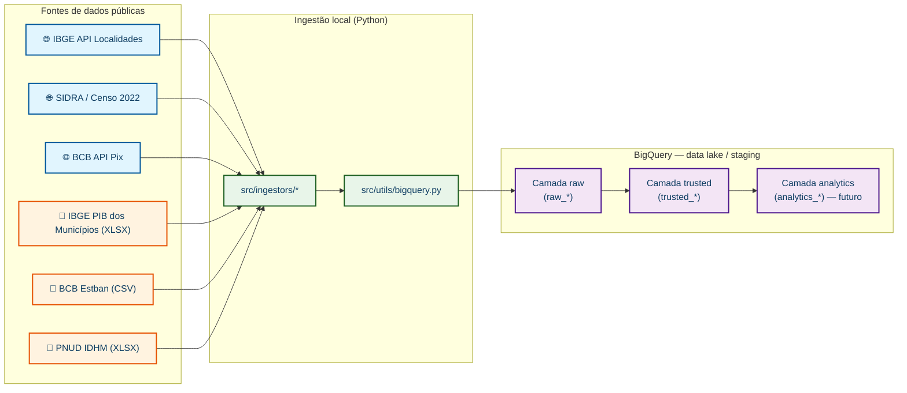
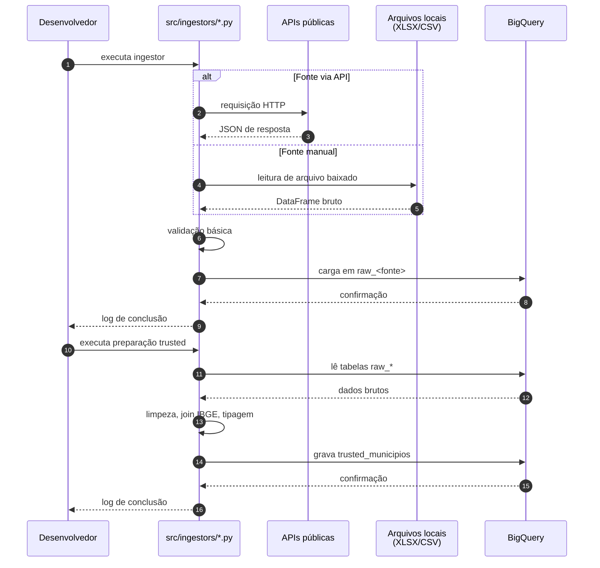
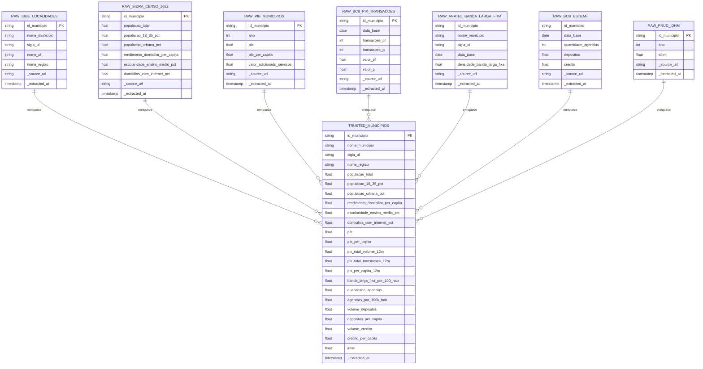
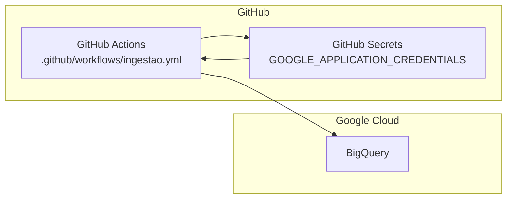

# Arquitetura Técnica — Ingestão e Coleta (IPB)

## 1. Visão geral

Este documento descreve o desenho técnico de ponta a ponta para a **Etapa 1 — Ingestão e Coleta** do Índice de Potencial Bancário (IPB).

**Abordagem aprovada**: scripts Python executados localmente, com persistência dos dados no **BigQuery** (camada `raw` e `trusted`) usando o **free tier**.

A arquitetura é modular: cada fonte de dados tem seu próprio script de ingestão, e o BigQuery funciona como data lake/staging. Futuramente, a orquestração pode migrar para GitHub Actions sem reescrever os scripts.

**Fontes de dados**:
- **APIs**: IBGE Localidades, IBGE SIDRA, BCB Pix — coleta automatizada por script.
- **Downloads manuais**: IBGE PIB, BCB Estban, Anatel Banda Larga Fixa, PNUD IDHM — baixados pelo time e lidos pelos scripts.
- **Fora do escopo**: Banda larga móvel (muitos dados, baixo impacto esperado; não entra).

---

## 2. Requisitos funcionais

| ID | Requisito | Prioridade |
|----|-----------|------------|
| RF01 | Coletar a tabela-mestra de municípios do IBGE (código IBGE de 7 dígitos, nome, UF, região). | Alta |
| RF02 | Coletar os indicadores do NÚCLEO definidos no `IPB_Guia_de_Bases_e_Desenho.md`. | Alta |
| RF03 | Persistir dados brutos no BigQuery com prefixo `raw_`. | Alta |
| RF04 | Normalizar, tipar e enriquecer os dados brutos para a camada `trusted_`. | Alta |
| RF05 | Gerar a base consolidada `trusted_municipios` (1 linha = 1 município). | Alta |
| RF06 | Registrar origem e timestamp de extração em todas as tabelas. | Média |
| RF07 | Permitir re-execução idempotente dos scripts (sobrescrever tabela). | Média |
| RF08 | Suportar execução local simples, sem infraestrutura extra. | Alta |

---

## 3. Requisitos não funcionais

| ID | Requisito | Como atender |
|----|-----------|--------------|
| RNF01 | **Custo zero** | BigQuery sandbox/free tier; APIs públicas gratuitas; execução local. |
| RNF02 | **Rastreabilidade** | Colunas `_source_url`, `_extracted_at` em todas as tabelas; commits com mensagens claras. |
| RNF03 | **Reusabilidade** | Funções utilitárias compartilhadas (`src/utils/`) e ingestores independentes. |
| RNF04 | **Segurança de credenciais** | `.env` e service account JSON fora do repositório; `.gitignore` configurado. |
| RNF05 | **Modularidade** | Um script por fonte; troca de fonte não quebra o pipeline todo. |
| RNF06 | **Evolução** | Estrutura preparada para GitHub Actions no futuro. |

---

## 4. Desenho de ponta a ponta

### 4.1 Arquitetura de dados



> **Legenda**: azul = API automatizada; laranja = arquivo baixado manualmente; verde = scripts Python; cinza = cache local; roxo = BigQuery.

### 4.2 Código `.mermaid`

```text
flowchart LR
    classDef api fill:#e1f5fe,stroke:#01579b,stroke-width:2px,color:#0d3c61
    classDef manual fill:#fff3e0,stroke:#e65100,stroke-width:2px,color:#0d3c61
    classDef script fill:#e8f5e9,stroke:#1b5e20,stroke-width:2px,color:#0d3c61
    classDef bq fill:#f3e5f5,stroke:#4a148c,stroke-width:2px,color:#0d3c61

    subgraph Fontes["Fontes de dados públicas"]
        F1["🌐 IBGE API Localidades"]:::api
        F2["🌐 SIDRA / Censo 2022"]:::api
        F3["🌐 BCB API Pix"]:::api
        F4["📁 IBGE PIB dos Municípios (XLSX)"]:::manual
        F5["📁 BCB Estban (CSV)"]:::manual
        F6["📁 PNUD IDHM (XLSX)"]:::manual
    end

    subgraph Ingestao["Ingestão local (Python)"]
        I1["src/ingestors/*"]:::script
        I2["src/utils/bigquery.py"]:::script
    end

    subgraph BigQuery["BigQuery — data lake / staging"]
        R["Camada raw\n(raw_*)"]:::bq
        T["Camada trusted\n(trusted_*)"]:::bq
        A["Camada analytics\n(analytics_*) — futuro"]:::bq
    end

    F1 --> I1
    F2 --> I1
    F3 --> I1
    F4 --> I1
    F5 --> I1
    F6 --> I1

    I1 --> I2
    I2 --> R
    R --> T
    T --> A
```

### 4.3 Fluxo de execução local



### 4.4 Modelo de camadas no BigQuery



---

## 5. Matriz de fontes × método × destino

| Pilar | Indicador | Fonte | Método de coleta | Tabela `raw_` | Tipo | Observações |
|-------|-----------|-------|------------------|---------------|------|-------------|
| A | População residente | IBGE SIDRA | API | `raw_sidra_censo_2022` | 🌐 API | Chave: `id_municipio` |
| A | Rendimento domiciliar per capita | IBGE SIDRA | API | `raw_sidra_censo_2022` | 🌐 API | Mesma tabela do item acima |
| A | PIB municipal / per capita | IBGE | Download XLSX | `raw_pib_municipios` | 📁 Manual | Planilha única 2010–2023 |
| B | Crescimento populacional 2010→2022 | IBGE SIDRA | API | `raw_sidra_censo_2010` + `raw_sidra_censo_2022` | 🌐 API | stretch — variação percentual |
| B | Crescimento do Pix | BCB Olinda | API | `raw_bcb_pix_transacoes` | 🌐 API | stretch — calculado sobre a série |
| C | Volume Pix PF/PJ per capita | BCB Olinda | API | `raw_bcb_pix_transacoes` | 🌐 API | `pix_total_volume_12m / populacao_total` |
| C | % domicílios com internet | IBGE SIDRA | API | `raw_sidra_censo_2022` | 🌐 API | Tabela 7307 — instável; usar Anatel como proxy |
| C | Banda larga fixa por 100 hab. | Anatel | Download CSV | `raw_anatel_banda_larga_fixa` | 📁 Manual | Arquivo já baixado; 5.571 registros no mês mais recente |
| D | Agências por 100 mil hab. | BCB — Estban | Download CSV | `raw_bcb_estban` | 📁 Manual | `quantidade_agencias / populacao * 100.000` |
| D | Depósitos e crédito per capita | BCB — Estban | Download CSV | `raw_bcb_estban` | 📁 Manual | `volume_depositos` / `volume_credito` por população |
| E | % população 18–35 anos | IBGE SIDRA | API | `raw_sidra_censo_2022` | 🌐 API | Tabela 9514 |
| E | % população urbana | IBGE SIDRA | API | `raw_sidra_censo_2022` | 🌐 API | Tabela 10089 |
| E | Escolaridade (% ensino médio+) | IBGE SIDRA | API | `raw_sidra_censo_2022` | 🌐 API | Tabela 10061 — indicador principal do pilar E |
| E | IDHM | Ipeadata (PNUD/Atlas 2010) | API | `raw_pnud_idhm` | 🌐 API | Variável histórica; Atlas 2022 indisponível |
| — | Tabela-mestra | IBGE API Localidades | API | `raw_ibge_localidades` | 🌐 API | Base para joins e nomes padronizados |

> **Fora do escopo**: banda larga móvel (dados volumosos, baixo impacto esperado; não entra nem como stretch).

---

## 6. Detalhamento dos componentes

### 6.1 Ingestores (`src/ingestors/`)

Cada ingestor é responsável por uma fonte. Interface esperada:

```python
def coletar() -> pd.DataFrame:
    """Coleta dados da fonte e retorna um DataFrame bruto."""
    ...

def carregar_no_bigquery(df: pd.DataFrame, tabela: str):
    """Sobe o DataFrame para a camada raw do BigQuery."""
    ...
```

Ingestores do núcleo:
- `ibge_localidades.py` — API
- `sidra_censo_2022.py` — API
- `ibge_pib_municipios.py` — leitura de XLSX baixado manualmente
- `bcb_pix.py` — API
- `anatel_banda_larga_fixa.py` — leitura de CSV baixado manualmente
- `bcb_estban.py` — leitura de CSV baixado manualmente
- `pnud_idhm.py` — leitura de XLSX baixado manualmente (se disponível)

### 6.2 Utilitários (`src/utils/`)

- `ibge.py`: busca tabela-mestra, valida código IBGE.
- `bigquery.py`: cliente reutilizável, funções `upload_df_to_bq` e `read_bq_to_df`.
- `storage.py`: funções auxiliares para leitura de arquivos locais (CSV, XLSX).

> **Nota**: o desenho aprovado inclui **cache local em Parquet** (`data/raw/<fonte>/*.parquet`) como estágio intermediário. Os scripts leem das APIs/arquivos, salvam localmente e depois sobem para o BigQuery. Isso garante idempotência, reprodutibilidade e desacoplamento das APIs.

### 6.3 BigQuery

- **Projeto GCP**: a ser criado pelo time.
- **Dataset**: `ipb_staging` (ajustável via `.env`).
- **Localização**: `US` (multi-região padrão do BigQuery Always Free / Sandbox, garantindo 100% de gratuidade sem necessidade de cartão/faturamento ativo).
- **Camadas**:
  - `raw_*`: dados quase intactos, com colunas de auditoria.
  - `trusted_*`: dados limpos e unificados.
  - `analytics_*`: agregações (futuro).

---

## 7. Considerações de custo e limites do free tier

### BigQuery sandbox / free tier

- **Storage**: 10 GB gratuitos por mês.
- **Query processing**: 1 TB gratuito por mês.
- **Streaming inserts**: 2 milhões de linhas/dia gratuitos (não devemos usar; usamos `load_table_from_dataframe`).
- Nosso volume (~5.570 municípios × ~12 indicadores) cabe facilmente nos 10 GB.

### GitHub Actions (opção futura)

- Plano gratuito: 2.000 minutos/mês.
- Execução one-shot: pipeline completo deve rodar em poucos minutos.
- Recorrência mensal: também cabe confortavelmente.

### APIs e downloads

- IBGE SIDRA: gratuita, com limites de requisição; usar throttling.
- BCB Olinda: gratuita, sem autenticação para dados abertos.
- IBGE PIB: download manual, sem autenticação.
- BCB Estban: download manual, sem autenticação.
- PNUD IDHM: download manual, sem autenticação (quando o site está disponível).

---

## 8. Riscos e mitigações

| Risco | Impacto | Mitigação |
|-------|---------|-----------|
| BCB Estban mudou formato de download | Alto | Validar no 1º dia; ter plano B (cadastro de agências no Portal de Dados Abertos do BCB). |
| API do IBGE indisponível | Médio | Retentar com backoff; reexecutar script mais tarde. |
| Custo inesperado no BigQuery | Baixo | Usar dataset no sandbox; monitorar billing; evitar queries full-scan. |
| Código IBGE divergente entre fontes | Médio | Usar tabela-mestra do IBGE como referência; validar joins. |
| IDHM indisponível | Alto | Ver alternativas na seção 9. |

---

## 9. Decisão sobre o IDHM

A fonte oficial (`Atlas Brasil` / PNUD) apresentou instabilidade (`HTTP 500`) e não foi possível obter o IDHM 2022. A decisão adotada foi:

1. **IDHM 2010 via Ipeadata**: coletado pela API do Ipeadata (`ADH_IDHM`), mantido como variável histórica de referência.
2. **Escolaridade (% ensino médio+) do Censo 2022**: indicador principal do pilar E, obtido via SIDRA Tabela 10061.

> **Base dos Dados**: reservada para **validação cruzada** futura, não como fonte primária do pipeline.

Essa abordagem mantém o pilar E funcional com dados oficiais e reprodutíveis, sem depender da disponibilidade do site do Atlas Brasil.

---

## 10. Fluxo de execução one-shot sugerido

1. Configurar `.env` com `GCP_PROJECT_ID`, `BIGQUERY_DATASET`, `BIGQUERY_LOCATION` e, opcionalmente, `GOOGLE_APPLICATION_CREDENTIALS`.
2. Criar dataset `ipb_staging` no BigQuery (localização `US`).
3. Executar `src/ingestors/ibge_localidades.py` → gera `raw_ibge_localidades`.
4. Executar ingestores independentes em qualquer ordem:
   - `sidra_censo_2022.py` (API)
   - `ibge_pib_municipios.py` (XLSX via GCS)
   - `bcb_pix.py` (API)
   - `anatel_banda_larga_fixa.py` (CSV via GCS)
   - `bcb_estban.py` (CSV via GCS)
   - `pnud_idhm.py` (API Ipeadata — IDHM 2010)
5. Executar `src/preparacao/trusted_municipios.py` → lê tabelas `raw_*`, faz joins e grava `trusted_municipios`.
6. Validar qualidade conforme checklist do `AGENTS.md`.

---

## 11. Próximos passos pós-desenho

1. Criar projeto no Google Cloud Console.
2. Ativar APIs: BigQuery API e Cloud Storage API.
3. Criar dataset `ipb_staging` na região `US` (Free Tier).
4. Configurar autenticação local (`gcloud auth application-default login` ou JSON de service account).
5. Manter `.env.example` atualizado.
6. Implementar ingestores do núcleo.
7. Adicionar testes unitários para ingestores e utilitários.

---

## 12. Evolução para GitHub Actions (futuro)

A arquitetura local foi desenhada para migrar facilmente:



Bastará:
- Criar service account com permissão `BigQuery Data Editor` e `BigQuery Job User`.
- Armazenar JSON da service account no GitHub Secret.
- Criar workflow com `schedule` (cron) ou `workflow_dispatch`.

> **Atenção**: com a arquitetura aprovada, fontes manuais (PIB, Estban, IDHM) precisarão ser baixadas previamente ou substituídas por fontes API para rodar 100% no GitHub Actions.

---

*Documento v3 — arquitetura revisada: com cache local Parquet, fontes via GCS Data Lake, IDHM 2010 via Ipeadata e banda larga móvel fora do escopo.*
