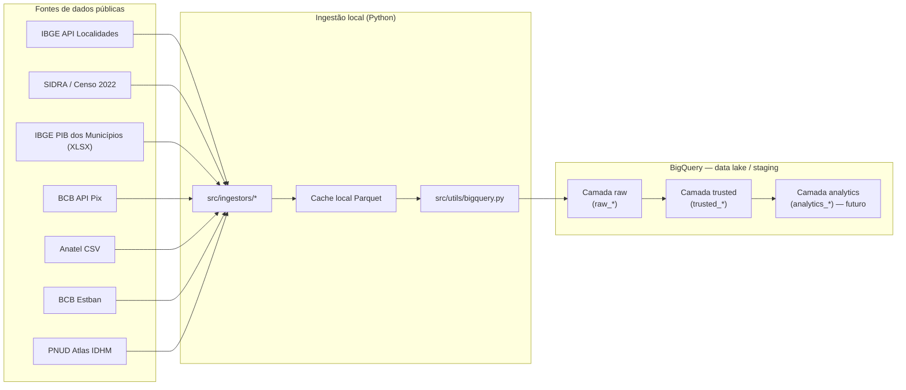
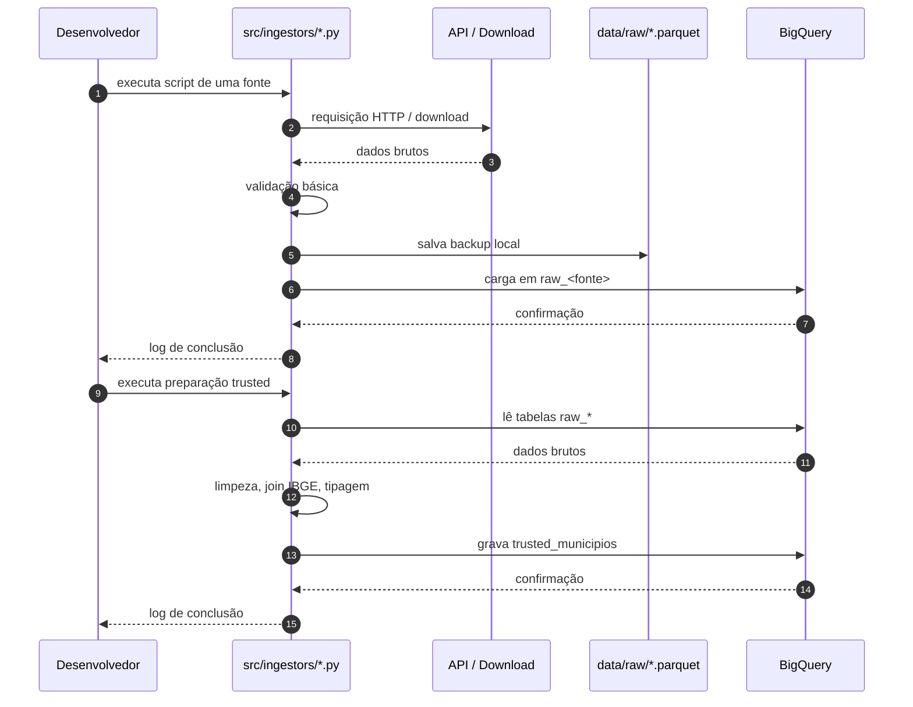
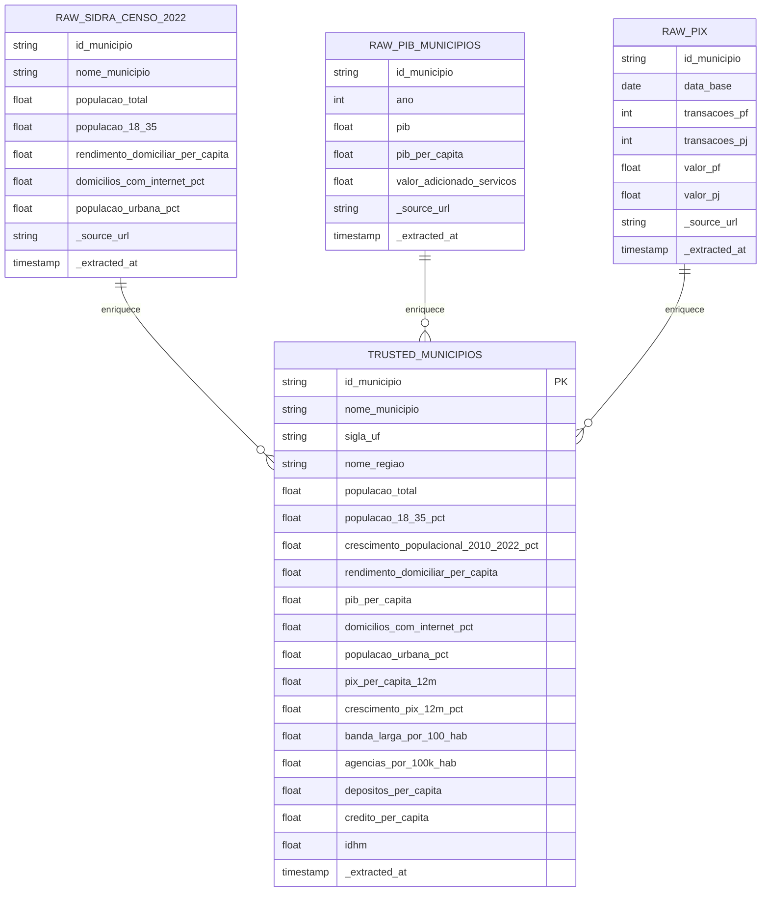
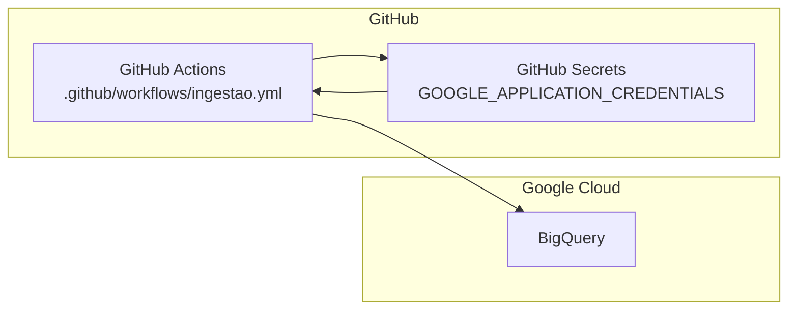

# Arquitetura Técnica — Ingestão e Coleta (IPB)

## 1. Visão geral

Este documento descreve o desenho técnico de ponta a ponta para a **Etapa 1 — Ingestão e Coleta** do Índice de Potencial Bancário (IPB).

**Abordagem aprovada**: scripts Python executados localmente, com persistência dos dados no **BigQuery** (camada `raw` e `trusted`) usando o **free tier**.

A arquitetura é modular: cada fonte de dados tem seu próprio script de ingestão, e o BigQuery funciona como data lake/staging. Futuramente, a orquestração pode migrar para GitHub Actions sem reescrever os scripts.

---

## 2. Requisitos funcionais

| ID | Requisito | Prioridade |
|----|-----------|------------|
| RF01 | Coletar a tabela-mestra de municípios do IBGE (código IBGE de 7 dígitos, nome, UF, região). | Alta |
| RF02 | Coletar os indicadores do NÚCLEO definidos no `IPB_Guia_de_Bases_e_Desenho.md`. | Alta |
| RF03 | Persistir dados brutos no BigQuery com prefixo `raw_`. | Alta |
| RF04 | Normalizar, tipar e enriquecer os dados brutos para a camada `trusted_`. | Alta |
| RF05 | Gerar a base consolidada `trusted_municipios` (1 linha = 1 município). | Alta |
| RF06 | Registrar origem e timestamp de extração em todas as tabelas. | Média |
| RF07 | Permitir re-execução idempotente dos scripts (sobrescrever tabela ou particionar por data). | Média |
| RF08 | Suportar execução local simples, sem infraestrutura extra. | Alta |

---

## 3. Requisitos não funcionais

| ID | Requisito | Como atender |
|----|-----------|--------------|
| RNF01 | **Custo zero** | BigQuery sandbox/free tier; APIs públicas gratuitas; execução local. |
| RNF02 | **Rastreabilidade** | Colunas `_source_url`, `_extracted_at` em todas as tabelas; commits com mensagens claras. |
| RNF03 | **Reusabilidade** | Funções utilitárias compartilhadas (`src/utils/`) e ingestores independentes. |
| RNF04 | **Segurança de credenciais** | `.env` e service account JSON fora do repositório; `.gitignore` configurado. |
| RNF05 | **Modularidade** | Um script por fonte; troca de fonte não quebra o pipeline todo. |
| RNF06 | **Evolução** | Estrutura preparada para GitHub Actions no futuro. |

---

## 4. Desenho de ponta a ponta

### 4.1 Arquitetura de dados



### 4.2 Fluxo de execução local



### 4.3 Modelo de camadas no BigQuery



---

## 5. Matriz de fontes × método × destino

| Pilar | Indicador | Fonte | Método de coleta | Tabela `raw_` | Observações |
|-------|-----------|-------|------------------|---------------|-------------|
| A | População residente | IBGE SIDRA | API | `raw_sidra_censo_2022` | Chave: `id_municipio` |
| A | Rendimento domiciliar per capita | IBGE SIDRA | API | `raw_sidra_censo_2022` | Mesma tabela do item acima |
| A | PIB municipal / per capita | IBGE | Download XLSX | `raw_pib_municipios` | Planilha única 2010–2023 |
| B | Crescimento populacional 2010→2022 | IBGE SIDRA | API | `raw_sidra_censo_2010` + `raw_sidra_censo_2022` | Calcular variação percentual |
| B | Crescimento do Pix | BCB Olinda | API | `raw_bcb_pix_transacoes` | Loop mensal, últimos 12–24 meses |
| C | Transações Pix PF/PJ | BCB Olinda | API | `raw_bcb_pix_transacoes` | Mesma base do pilar B |
| C | Banda larga fixa/móvel por 100 hab. | Anatel | Download CSV | `raw_anatel_banda_larga` | Pode vir por nome de município — exigir fuzzy join |
| C | % domicílios com internet | IBGE SIDRA | API | `raw_sidra_censo_2022` | Mesma tabela do pilar A |
| D | Agências por 100 mil hab. | BCB Estban | Download CSV/Portal | `raw_bcb_estban` | Validar formato atual com urgência |
| D | Depósitos e crédito per capita | BCB Estban | Download CSV/Portal | `raw_bcb_estban` | Mesma base do item acima |
| E | % população 18–35 anos | IBGE SIDRA | API | `raw_sidra_censo_2022` | Mesma tabela do pilar A |
| E | % população urbana | IBGE SIDRA | API | `raw_sidra_censo_2022` | Mesma tabela do pilar A |
| E | IDHM | PNUD Atlas | Download XLSX | `raw_pnud_idhm` | Planilha por município |
| — | Tabela-mestra | IBGE API Localidades | API | `raw_ibge_localidades` | Base para joins e nomes padronizados |

---

## 6. Detalhamento dos componentes

### 6.1 Ingestores (`src/ingestors/`)

Cada ingestor é responsável por uma fonte. Interface esperada:

```python
def coletar() -> pd.DataFrame:
    """Coleta dados da fonte e retorna um DataFrame bruto."""
    ...

def carregar_no_bigquery(df: pd.DataFrame, tabela: str):
    """Sobe o DataFrame para a camada raw do BigQuery."""
    ...
```

Ingestores previstos:
- `ibge_localidades.py`
- `sidra_censo_2022.py`
- `ibge_pib_municipios.py`
- `bcb_pix.py`
- `anatel_banda_larga.py`
- `bcb_estban.py`
- `pnud_idhm.py`

### 6.2 Utilitários (`src/utils/`)

- `ibge.py`: busca tabela-mestra, valida código IBGE, fuzzy matching de nomes.
- `bigquery.py`: cliente reutilizável, funções `upload_df_to_bq` e `read_bq_to_df`.
- `storage.py`: leitura/escrita de Parquet local.

### 6.3 BigQuery

- **Projeto GCP**: a ser criado pelo time.
- **Dataset**: `ipb_staging` (ajustável via `.env`).
- **Localização**: `southamerica-east1` (São Paulo) — reduz latência para APIs brasileiras.
- **Camadas**:
  - `raw_*`: dados quase intactos, com colunas de auditoria.
  - `trusted_*`: dados limpos e unificados.
  - `analytics_*`: agregações (futuro).

---

## 7. Considerações de custo e limites do free tier

### BigQuery sandbox / free tier

- **Storage**: 10 GB gratuitos por mês.
- **Query processing**: 1 TB gratuito por mês.
- **Streaming inserts**: 2 milhões de linhas/dia gratuitos (não devemos usar; usamos `load_table_from_dataframe`).
- Nosso volume (~5.570 municípios × ~15 indicadores) cabe facilmente nos 10 GB.

### GitHub Actions (opção futura)

- Plano gratuito: 2.000 minutos/mês.
- Execução one-shot: pipeline completo deve rodar em poucos minutos.
- Recorrência mensal: também cabe confortavelmente.

### APIs e downloads

- IBGE SIDRA: gratuita, com limites de requisição; usar throttling.
- BCB Olinda: gratuita, sem autenticação para dados abertos.
- Anatel CSV: download direto, sem autenticação.
- PNUD Atlas: download de XLSX, sem autenticação.

---

## 8. Riscos e mitigações

| Risco | Impacto | Mitigação |
|-------|---------|-----------|
| BCB Estban mudou formato de download | Alto | Validar no 1º dia; ter plano B (cadastro de agências no Portal de Dados Abertos do BCB). |
| API do IBGE indisponível | Médio | Cache local em Parquet; retentar com backoff. |
| Custo inesperado no BigQuery | Baixo | Usar dataset no sandbox; monitorar billing; evitar queries full-scan. |
| Código IBGE divergente entre fontes | Médio | Usar tabela-mestra do IBGE como referência; validar joins. |
| Anatel vem por nome de município | Médio | Fuzzy matching controlado; log de baixa confiança. |

---

## 9. Fluxo de execução one-shot sugerido

1. Configurar `.env` e autenticar no GCP (`gcloud auth application-default login`).
2. Criar dataset `ipb_staging` no BigQuery.
3. Executar `src/ingestors/ibge_localidades.py` → gera `raw_ibge_localidades`.
4. Executar ingestores independentes em qualquer ordem:
   - `sidra_censo_2022.py`
   - `ibge_pib_municipios.py`
   - `bcb_pix.py`
   - `anatel_banda_larga.py`
   - `bcb_estban.py`
   - `pnud_idhm.py`
5. Executar `src/preparacao/trusted_municipios.py` → lê tabelas `raw_*`, faz joins e grava `trusted_municipios`.
6. Validar qualidade conforme checklist do `AGENTS.md`.

---

## 10. Próximos passos pós-desenho

1. Criar projeto no Google Cloud Console.
2. Ativar APIs: BigQuery API.
3. Criar dataset `ipb_staging` na região `southamerica-east1`.
4. Configurar autenticação local (`gcloud auth application-default login` ou service account).
5. Criar `requirements.txt` e `.env.example`.
6. Implementar ingestores na ordem de risco (começar por Estban e Anatel, que têm mais incerteza).
7. Adicionar testes unitários para utilitários.

---

## 11. Evolução para GitHub Actions (futuro)

A arquitetura local foi desenhada para migrar facilmente:



Bastará:
- Criar service account com permissão `BigQuery Data Editor` e `BigQuery Job User`.
- Armazenar JSON da service account no GitHub Secret.
- Criar workflow com `schedule` (cron) ou `workflow_dispatch`.

---

*Documento v1 — arquitetura de ingestão e coleta do IPB.*
