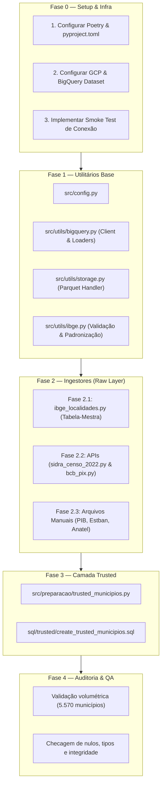

# Plano de Implementação — Ingestão e Coleta de Dados (IPB)

Este documento estabelece o **roteiro técnico passo a passo** para a implementação da Etapa 1 do Índice de Potencial Bancário (IPB).

---

## 1. Visão Geral e Pré-requisitos de Arquitetura

### 1.1 Gerenciamento de Dependências: Poetry
Adotamos o **Poetry** para garantir:
- Reprodutibilidade exata de ambiente via `poetry.lock`.
- Resolução estrita de conflitos entre bibliotecas analíticas (`pandas`, `pyarrow`, `google-cloud-bigquery`).
- Isolamento do ambiente virtual dentro do projeto (`.venv/`).

### 1.2 Segurança e Credenciais GCP (Zero Secrets no Git)
A persistência no BigQuery deve operar sem expor nenhuma chave:
1. **Desenvolvimento Local (Recomendado)**: Uso do **Application Default Credentials (ADC)** via `gcloud auth application-default login`. Dessa forma, nenhuma chave JSON reside no disco do repositório.
2. **Ambiente com Service Account (Opcional/CI)**: Se utilizada chave JSON, a variável de ambiente `GOOGLE_APPLICATION_CREDENTIALS` deve apontar para um arquivo fora do repositório ou com caminho explicitamente ignorado no `.gitignore` (`*.json`).
3. **Variáveis de Configuração**: Gerenciadas via `.env` (com template em `.env.example`).

---

## 2. Roteiro de Implementação em Fases



---

## 3. Detalhamento Passo a Passo

### Fase 0: Setup, Gerenciamento de Dependências e Conexão GCP

#### Passo 0.1 — Inicialização do Poetry
- Inicializar projeto: `poetry init` com Python `^3.11`.
- Configurar ambiente virtual no diretório local:
  ```bash
  poetry config virtualenvs.in-project true
  ```
- Dependências principais a adicionar:
  - `pandas = "^2.2.0"`
  - `pyarrow = "^15.0.0"` (otimização de leitura/escrita Parquet e carga BQ)
  - `google-cloud-bigquery = "^3.18.0"`
  - `google-cloud-bigquery-storage = "^2.24.0"` (acelera downloads do BQ)
  - `requests = "^2.31.0"`
  - `python-dotenv = "^1.0.1"`
  - `openpyxl = "^3.1.2"` (leitura de XLSX)
  - `pydantic-settings = "^2.2.0"` ou `python-dotenv` para parsing de config.
- Dependências de desenvolvimento:
  - `pytest = "^8.0.0"`
  - `ruff = "^0.3.0"` (linter rápido)

#### Passo 0.2 — Configuração do Google Cloud Platform
1. Criar ou selecionar projeto no console GCP: `GCP_PROJECT_ID`.
2. Habilitar APIs necessárias:
   - BigQuery API: `gcloud services enable bigquery.googleapis.com`
3. Criar dataset de staging:
   - Nome: `ipb_staging`
   - Localização: `US` (multi-região padrão do BigQuery Always Free / Sandbox, sem necessidade de cartão/faturamento)
4. Autenticar localmente via ADC:
   ```bash
   gcloud auth application-default login
   ```
5. Criar `.env.example` e `.env`:
   ```bash
   GCP_PROJECT_ID=meu-projeto-ipb-mba
   BIGQUERY_DATASET=ipb_staging
   BIGQUERY_LOCATION=US
   RAW_DATA_DIR=data/raw
   PROCESSED_DATA_DIR=data/processed
   ```

#### Passo 0.3 — Script de Smoke Test de Conexão GCP
- Criar `tests/test_bq_connection.py` ou `src/utils/test_connection.py`:
  - Instancia o `bigquery.Client(project=GCP_PROJECT_ID, location=BIGQUERY_LOCATION)`.
  - Executa uma query simples (`SELECT 1 AS status`).
  - Cria temporariamente uma tabela de teste no dataset `ipb_staging`, faz append de 1 linha e remove a tabela de teste.
  - Exibe diagnóstico claro de sucesso ou erro de permissão.

---

### Fase 1: Módulos Utilitários (`src/config.py` e `src/utils/`)

#### Passo 1.1 — `src/config.py`
- Centraliza variáveis de ambiente via `pydantic` ou `python-dotenv`.
- Define constantes de diretórios locais (`DATA_RAW_DIR`, `DATA_PROCESSED_DIR`).
- Define nomes padronizados das tabelas no BigQuery (`raw_ibge_localidades`, `raw_sidra_censo_2022`, `trusted_municipios`, etc.).

#### Passo 1.2 — `src/utils/storage.py`
- `save_raw_parquet(df: pd.DataFrame, source_name: str, filename: str) -> Path`:
  - Salva DataFrame em `data/raw/{source_name}/{filename}.parquet` com compressão `snappy`.
  - Cria diretórios pais automaticamente se não existirem.
- `load_raw_parquet(source_name: str, filename: str) -> pd.DataFrame`:
  - Lê arquivo Parquet do cache local.

#### Passo 1.3 — `src/utils/bigquery.py`
- `get_bigquery_client() -> bigquery.Client`:
  - Retorna cliente autenticado com base nas configurações de `src/config.py`.
- `upload_dataframe_to_raw(df: pd.DataFrame, table_name: str, if_exists: str = "replace")`:
  - Adiciona colunas de auditoria obrigatórias:
    - `_extracted_at` (TIMESTAMP UTC)
    - `_source_url` (STRING)
  - Converte types problemáticos antes do envio.
  - Realiza carga direta no BigQuery via `LoadJobConfig` com formato Parquet em memória (rápido e econômico).
- `read_table_to_dataframe(table_name: str) -> pd.DataFrame`:
  - Executa leitura da tabela no BigQuery retornando DataFrame.

#### Passo 1.4 — `src/utils/ibge.py`
- `normalize_ibge_code(code: Any) -> str`:
  - Garante código IBGE com exatamente 7 dígitos (com zero à esquerda se truncado).
- `validate_ibge_code(code: str) -> bool`:
  - Valida formato e dígito verificador IBGE.

---

### Fase 2: Implementação dos Ingestores (`src/ingestors/`)

Padrão arquitetural de todo ingestor:
```python
def extract() -> pd.DataFrame: ...
def transform_raw(raw_data: Any) -> pd.DataFrame: ...
def run() -> None:
    # 1. Extrai / Lê
    # 2. Salva em data/raw/<fonte>/<data>.parquet (Cache local)
    # 3. Faz upload para raw_<fonte> no BigQuery
```

#### Passo 2.1 — Ingestor Tabela-Mestra: `ibge_localidades.py`
- **Fonte**: API IBGE Localidades (`https://servicodados.ibge.gov.br/api/v1/localidades/municipios`).
- **Destino**: `data/raw/ibge_localidades/` e tabela BQ `raw_ibge_localidades`.
- **Colunas**: `id_municipio` (7 dígitos), `nome_municipio`, `sigla_uf`, `nome_uf`, `nome_regiao`.

#### Passo 2.2 — Ingestor API: `sidra_censo_2022.py`
- **Fonte**: API SIDRA (Agregados Censo 2022).
- **Tratamento de URL & Throttling**:
  - `localidades=N6[all]` codificado via requests.
  - Implementar retries com `urllib3.util.retry` / `requests.adapters.HTTPAdapter`.
- **Indicadores Coletados**:
  1. População residente total (Censo 2022).
  2. População de 18 a 35 anos (faixa jovem economicamente ativa).
  3. Rendimento domiciliar per capita.
  4. % Domicílios com acesso à internet.
  5. % População urbana.
  6. **Substituto do IDHM**: Escolaridade (% de pessoas com ensino médio completo ou taxa de alfabetização).
- **Destino**: `raw_sidra_censo_2022`.

#### Passo 2.3 — Ingestor API: `bcb_pix.py`
- **Fonte**: API de Dados Abertos BCB Olinda (`https://olinda.bcb.gov.br/olinda/servico/PIX_DadosAbertos/versao/v1/odata/TransacoesPixPorMunicipio`).
- **Lógica de Coleta**:
  - Parâmetro obrigatório: `$filter=AnoMes eq 'YYYYMM'`.
  - Coletar os últimos 12 meses disponíveis em loop sequencial com delay de 0.5s entre chamadas.
- **Campos**: `id_municipio`, `ano_mes`, `quantidade_pf`, `quantidade_pj`, `valor_pf`, `valor_pj`.
- **Destino**: `raw_bcb_pix_transacoes`.

#### Passo 2.4 — Ingestor Manual: `ibge_pib_municipios.py`
- **Fonte**: `data/raw/ibge_pib_municipios/PIB dos Municípios - base de dados 2010-2023.xlsx`.
- **Lógica**:
  - Leitura via `pd.read_excel` (com `openpyxl`).
  - Filtrar o ano mais recente (2023).
  - Renomear colunas para padrão snake_case (`id_municipio`, `pib`, `pib_per_capita`, `va_servicos`).
- **Destino**: `raw_pib_municipios`.

#### Passo 2.5 — Ingestor Manual: `bcb_estban.py`
- **Fonte**: `data/raw/bcb_estaban/202603_ESTBAN.CSV` (encoding `latin1`, sep `;`).
- **Atenção Crítica**: O arquivo do Estban possui registros por dependência/agência bancária e por rubrica contábil (ex: 411 - Depósitos à Vista).
- **Agregação Obrigatória antes do Raw/Trusted**:
  - Agrupar por `id_municipio` (`CODMUN_IBGE`):
    - `quantidade_agencias`: contagem de agências únicas no município.
    - `volume_depositos`: soma das rubricas de depósitos.
    - `volume_credito`: soma das rubricas de operações de crédito.
- **Destino**: `raw_bcb_estban`.

#### Passo 2.6 — Ingestor Manual: `anatel_banda_larga_fixa.py`
- **Fonte**: `data/raw/anatel_banda_larga/Densidade_Banda_Larga_Fixa.csv` (UTF-8 BOM, sep `;`).
- **Lógica**:
  - Filtrar mês mais recente (2026-06).
  - Tratar código IBGE e coluna de densidade (converter vírgula decimal para ponto).
- **Destino**: `raw_anatel_banda_larga_fixa`.

#### Passo 2.7 — Ingestor IDHM (Opcional / Fallback): `pnud_idhm.py`
- Se o arquivo do Atlas for obtido, lê `data/raw/pnud_idhm/` e grava `raw_pnud_idhm`.
- Caso contrário, o pipeline utiliza diretamente os indicadores de escolaridade do Censo 2022 no pilar E.

---

### Fase 3: Consolidação da Camada Trusted (`src/preparacao/`)

#### Passo 3.1 — `src/preparacao/trusted_municipios.py`
1. Lê todas as tabelas `raw_*` do BigQuery (ou do cache local Parquet).
2. Usa `raw_ibge_localidades` como tabela base (`LEFT JOIN` em todas as outras fontes).
3. **Regras de Negócio e Tratamento de Missing**:
   - **Estban**: Municípios sem registro bancário recebem `quantidade_agencias = 0`, `volume_depositos = 0.0`, `volume_credito = 0.0`.
   - **Pix**: Somar os 12 meses para obter métricas anualizadas (`pix_total_volume_12m`, `pix_total_transacoes_12m`).
   - **Cálculo de Indicadores Per Capita / Densidade**:
     - `pib_per_capita = pib / populacao`
     - `pix_per_capita_12m = pix_total_volume_12m / populacao`
     - `agencias_por_100k_hab = (quantidade_agencias / populacao) * 100000`
     - `banda_larga_densidade = acessos_fixos / 100_domicilios`
4. Grava tabela consolidada `trusted_municipios` no BigQuery e salva `data/processed/trusted_municipios.parquet`.

#### Passo 3.2 — `sql/trusted/create_trusted_municipios.sql`
- Script DDL / query de referência caso se opte por executar a consolidação diretamente via SQL no BigQuery.

---

---

## 4. Estratégia de Testes e Cobertura de Código

Para garantir robustez de nível profissional no pipeline de engenharia de dados, estruturamos os testes em 3 níveis complementares:

```
tests/
├── unit/                        # Testes rápidos, isolados e sem dependências externas
│   ├── test_ibge_utils.py       # Validação e normalização de códigos IBGE (7 dígitos)
│   ├── test_storage_utils.py    # Escrita/leitura segura de Parquet e criação de pastas
│   ├── test_parsers_estban.py   # Lógica pura de agregação e soma contábil do Estban
│   └── test_parsers_anatel.py   # Limpeza e conversão decimal da Anatel
├── integration/                 # Testes de integração com serviços externos (GCP/APIs)
│   ├── test_bq_connection.py    # Smoke test de autenticação ADC e permissões BQ
│   └── test_api_endpoints.py    # Checagem de disponibilidade das APIs (IBGE, BCB)
└── data_quality/                # Testes de integridade e regras de negócio da camada Trusted
    └── test_trusted_quality.py  # Auditoria volumétrica, PK, tipos e faixas de valores
```

### 4.1 Testes Unitários (`tests/unit/`)
- **Objetivo**: Testar funções puras e utilitárias sem tocar em rede ou disco permanente.
- **Cenários Cobertos**:
  - `test_normalize_ibge_code`:
    - Códigos com 6 dígitos (inserção de zero à esquerda ou ajuste de DV).
    - Códigos passados como `int`, `float` ou `str`.
    - Códigos inválidos ou com caracteres especiais (disparo de exceção).
  - `test_storage_parquet`:
    - Criação correta de diretórios ao salvar `data/raw/<fonte>/*.parquet`.
    - Integridade dos dados pós-leitura (schema e valores preservados).
  - `test_estban_aggregation`:
    - Agrupamento correto de múltiplas agências e contas contábeis para o mesmo `CODMUN_IBGE`.
    - Tratamento de rubricas com valores nulos/ausentes.

### 4.2 Testes de Integração (`tests/integration/`)
- **Objetivo**: Garantir que as pontas externas (Google Cloud e APIs abertas) estejam acessíveis.
- **Cenários Cobertos**:
  - `test_bq_smoke`:
    - Autenticação válida via ADC (`gcloud`).
    - Permissão de escrita (`CREATE TABLE`) e deleção (`DROP TABLE`) no dataset `ipb_staging`.
  - `test_api_connectivity`:
    - Endpoint IBGE Localidades retornando status 200 e payload JSON válido.
    - Endpoint BCB Olinda Pix respondendo ao filtro `AnoMes`.

### 4.3 Testes de Qualidade de Dados (Data Quality / QA)
- **Objetivo**: Validar a tabela final `trusted_municipios` antes de liberar para a Etapa 2 (EDA).
- **Regras Validadas no `test_trusted_quality.py`**:
  1. **Volumetria Exata**: Tabela com 5.570 linhas (total oficial de municípios do Brasil).
  2. **Unicidade de Chave**: `id_municipio` sem duplicatas e 0% de nulos.
  3. **Completude Cadastral**: `nome_municipio`, `sigla_uf` e `nome_regiao` com 0% de nulos.
  4. **Limites e Consistência Numérica**:
     - `populacao_total > 0`
     - `rendimento_domiciliar_per_capita >= 0`
     - `pib_per_capita > 0`
     - `% domicilios com internet` no intervalo `[0.0, 100.0]`
     - `% populacao urbana` no intervalo `[0.0, 100.0]`
     - `quantidade_agencias >= 0` (inteiro não negativo)
  5. **Metadados de Auditoria**: `_extracted_at` preenchido com timestamp válido.

### 4.4 Meta e Relatório de Cobertura (`pytest-cov`)
- **Ferramenta**: `pytest` com plugin `pytest-cov`.
- **Meta de Cobertura**:
  - Módulos Utilitários (`src/utils/*`): **≥ 85% de cobertura**.
  - Parsers e Lógica de Transformação: **≥ 80% de cobertura**.
- **Comando de Execução**:
  ```bash
  poetry run pytest --cov=src --cov-report=term-missing --cov-report=html
  ```

---

## 5. Ordem Recomendada de Execução dos Comandos

```bash
# 1. Instalação e ambiente
poetry install
poetry shell

# 2. Teste de conexão GCP e testes unitários
python -m pytest tests/unit/
python -m pytest tests/integration/test_bq_connection.py

# 3. Execução da Tabela-Mestra
python -m src.ingestors.ibge_localidades

# 4. Execução dos Ingestores de API
python -m src.ingestors.sidra_censo_2022
python -m src.ingestors.bcb_pix

# 5. Execução dos Ingestores Manuais
python -m src.ingestors.ibge_pib_municipios
python -m src.ingestors.bcb_estban
python -m src.ingestors.anatel_banda_larga_fixa

# 6. Consolidação Trusted
python -m src.preparacao.trusted_municipios

# 7. Validação de Qualidade e Cobertura Total
python -m pytest tests/data_quality/
poetry run pytest --cov=src --cov-report=term-missing
```
