# Relatório de Análise Exploratória de Dados — IPB

> **Projeto**: Índice de Potencial Bancário (IPB)  
> **Etapa**: 2 — Análise Exploratória e Limpeza  
> **Base**: `trusted_municipios` (5.570 municípios) + tabelas `analytics_ipb_*` (3 versões do índice publicadas)  
> **Período de referência**: Censo 2022, PIB 2023, CEMPRE 2024, Pix jul/2025–jun/2026, Anatel/Estban 2026, Correspondentes BCB 30/08/2026, IDHM 2010  
> **Gerado em**: 2026-09-03

---

## 1. Objetivo

Este relatório consolida os principais achados da análise exploratória de dados (EDA) do IPB. A EDA teve como propósito:

- Avaliar a qualidade da base `trusted_municipios`.
- Explorar as tabelas `raw_*` para validar a construção da camada trusted.
- Identificar padrões, outliers e correlações entre os 5 pilares do índice.
- Calcular uma versão alpha do IPB e gerar um ranking inicial de municípios.

---

## 2. Base de dados e método

A análise foi conduzida em 7 notebooks reprodutíveis localizados em `notebooks/00_exploracao/`:

| Notebook | Propósito |
|----------|-----------|
| `00_setup_e_qualidade.ipynb` | Validação de qualidade da `trusted_municipios`. |
| `00b_auditoria_raws_e_features.ipynb` | Auditoria das tabelas `raw_*` e engenharia de features. |
| `01_perfil_demografico_e_geo.ipynb` | Análise do pilar E (perfil demográfico). |
| `02_economia_e_dinamismo.ipynb` | Análise dos pilares A e B (renda, PIB, Pix). |
| `03_infra_digital_e_gap_bancario.ipynb` | Análise dos pilares C e D (banda larga, agências). |
| `04_integracao_correlacoes.ipynb` | Correlações (incl. variáveis novas da V3) e cálculo alpha do IPB. |
| `05_comparacao_abordagens_ipb.ipynb` | Comparação das 3 versões do IPB **lendo as tabelas `analytics_ipb_*` do BigQuery** (seção 8 deste relatório). |

Os outputs de dados (parquet e relatórios JSON) foram salvos em `data/processed/`.  
As figuras geradas pela EDA foram salvas em `docs/assets/figures/` para ficarem versionadas junto com este relatório.

### 2.1 Correção e recálculo do Pix

Durante a análise de ponta a ponta do projeto, identificou-se um **bug crítico de duplicação** na tabela `raw_bcb_pix_transacoes`: cada mês aparecia múltiplas vezes (ex.: o mês `202606` aparecia 12 vezes), inflando artificialmente o volume Pix anualizado em aproximadamente **87%**.

A causa foi a ausência de `drop_duplicates` no ingestor `bcb_pix.py`, combinada a execuções sucessivas da rotina. O bug foi corrigido adicionando:

```python
df = df.drop_duplicates(subset=["id_municipio", "AnoMes"])
```

Após a correção, o ingestor foi re-executado para os **12 meses mais recentes** (ago/2025 a jul/2026), resultando em **72.421 registros** brutos únicos. A `trusted_municipios` e o IPB *alpha* foram recalculados com a série corrigida.

**Impacto nos dados**:

| Métrica | Antes da correção | Depois da correção | Redução |
|---|---|---|---|
| Pix total volume 12m (soma) | R$ 107,97 trilhões | R$ 13,84 trilhões | **87,2%** |
| Pix per capita médio | R$ 389.821 | R$ 49.901 | **87,2%** |
| Registros brutos na raw | 568.236 | 72.421 | **87,3%** |

---

## 3. Qualidade dos dados

A base `trusted_municipios` possui **5.570 municípios** e **26 colunas**, com `id_municipio` como chave primária única.

### 3.1 Nulos e gaps conhecidos

| Coluna | % Nulos | Observação |
|--------|---------|------------|
| `domicilios_com_internet_pct` | 100% | API do SIDRA indisponível para `N6[all]`; usa-se `banda_larga_fixa_por_100_hab` como proxy. |
| `idhm` | 0,11% | Vintage 2010; mantido como referência histórica. |
| `quantidade_agencias` | 0% | Municípios sem agência foram imputados com 0. |

Todas as regras de negócio validadas passaram:

- `populacao_total > 0` ✅
- `pib_per_capita > 0` ✅
- Percentuais entre 0 e 100 ✅
- `quantidade_agencias >= 0` ✅

### 3.2 Figuras relevantes


---

## 4. Perfil demográfico e geográfico (Pilar E)

### 4.1 Principais achados

- **Escolaridade**: Sudeste lidera com 44,35% da população 18+ com ensino médio completo; Nordeste tem o menor índice (33,95%).
- **Urbanização**: Sudeste (78,94%) e Centro-Oeste (76,2%) são as regiões mais urbanizadas; Nordeste (60,98%) e Norte (62,83%) são as menos urbanizadas.
- **População jovem (18–35)**: Norte tem a maior proporção (27,81%), seguido do Nordeste (26,85%).
- **1.098 municípios** apresentam perfil simultaneamente jovem, urbano e escolarizado acima da mediana.
- **Correlações**: as variáveis demográficas são relativamente independentes entre si, exceto pelo par `idhm` × `escolaridade_ensino_medio_pct` (0,78) e `populacao_urbana_pct` × `escolaridade_ensino_medio_pct` (0,70), indicando que municípios mais urbanos e com maior IDHM tendem a ser mais escolarizados. `populacao_18_35_pct` tem correlação fraca com as demais, o que é bom para o índice — significa que os pilares não estão todos medindo a mesma coisa.

### 4.2 Figuras relevantes


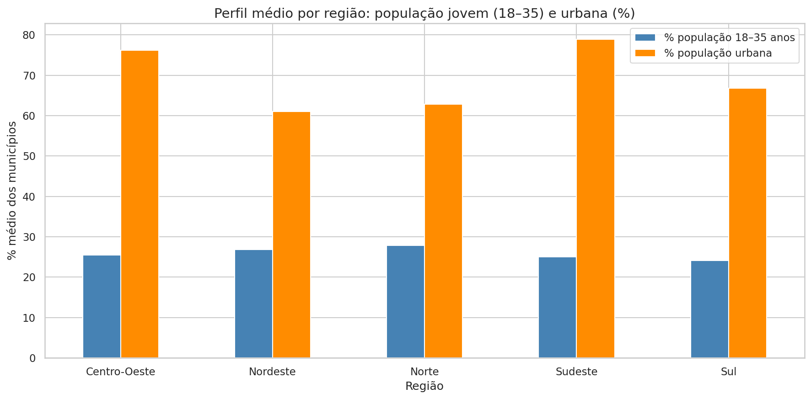


---

## 5. Capacidade de consumo e dinamismo (Pilares A e B)

### 5.1 Principais achados

- **Renda e PIB**: cidades grandes apresentam renda domiciliar per capita mediana de R$ 2.079,68 e PIB per capita de R$ 56.227,29; cidades pequenas ficam com R$ 1.145,36 e R$ 28.216,86, respectivamente. As distribuições de renda e PIB usam escala log porque ambas são fortemente assimétricas: poucos municípios concentram valores muito altos.
- **Pix per capita (12 meses)**: cresce conforme o estrato populacional — pequenas R$ 348.814, médias R$ 478.673, grandes R$ 645.788. A estratificação populacional segue o critério: pequena (< 50 mil hab.), média (50 mil–500 mil hab.) e grande (> 500 mil hab.).
- **Outlier no estrato pequeno**: Pacaraima (RR), com população de ~19 mil habitantes, registra R$ 516.520 de Pix per capita em 12 meses (meio milhão de reais) — provavelmente efeito do comércio de fronteira.
- **864 municípios** apresentam alta adoção Pix (acima da mediana) e renda abaixo da mediana, indicando potencial de inclusão financeira digital. O quadrante correspondente no scatter Pix × renda (`02_quadrante_pix_renda.png`) destaca o grupo em vermelho.
- A série temporal do Pix mostra concentração crescente de volume em meses recentes. O volume é apresentado em trilhões de reais (R$) e separado entre Pessoa Física (PF) e Pessoa Jurídica (PJ). Os dados brutos do BCB já contêm PJ, mas a camada `trusted` do IPB utiliza apenas PF como proxy de adoção digital no pilar B.

### 5.2 Figuras relevantes

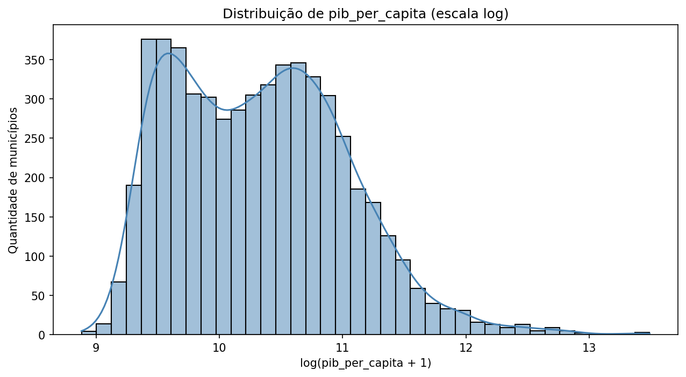

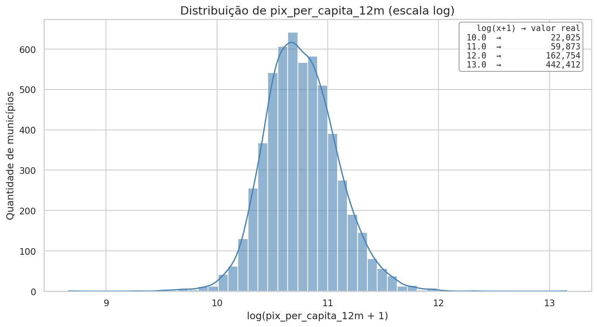

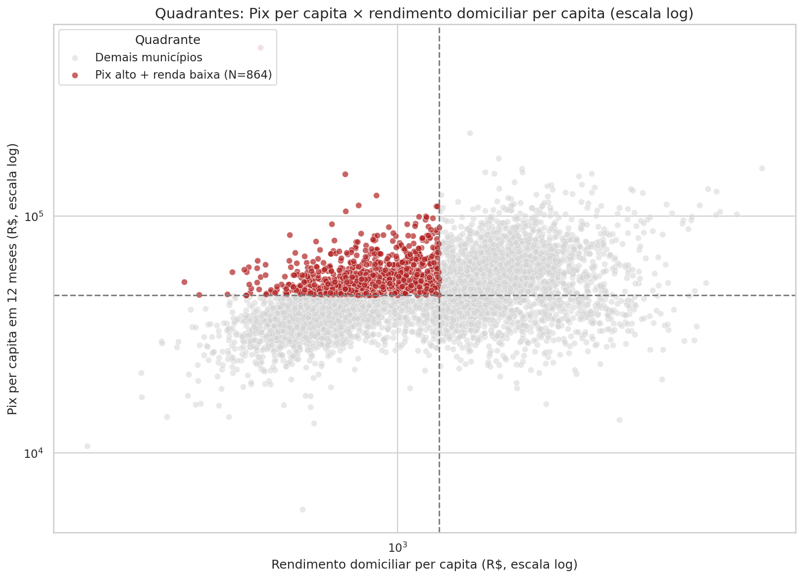


---

## 6. Infraestrutura digital e gap bancário (Pilares C e D)

### 6.1 Principais achados

- **Municípios sem agência bancária**: **2.656 municípios (47,68%)** não possuem agência bancária ativa.
- **UFs com maior gap**: Piauí (82,1%), Tocantins (80,6%), Paraíba (79,8%), Rio Grande do Norte (77,2%) e Roraima (66,7%).
- **Banda larga fixa**: a variável `banda_larga_fixa_por_100_hab` mede o número de acessos de banda larga fixa a cada 100 habitantes (taxa de penetração), não a velocidade em Mbps. Valores acima de 100 são possíveis quando há mais de uma linha por residência/empresa.
- **Quadrantes (banda larga × agências)**:
  - **Alto potencial**: 1.050 municípios (banda larga alta + poucas agências).
  - **Maduro saturado**: 1.735 municípios (banda larga alta + muitas agências).
  - **Desconectado**: 1.735 municípios (banda larga baixa + poucas agências).
  - **Bancarizado sem infra**: 1.050 municípios (banda larga baixa + muitas agências).
- **Correspondentes bancários (pilar D da V3)**: dos 216.873 correspondentes ativos do BCB (30/08/2026), **81,1% são do tipo Sede** (estabelecimento-sede do correspondente no cadastro do BCB), 15,4% Filial e 3,5% Posto — composição homogênea entre regiões (figura `03_correspondentes_tipo_regiao.png`). Ou seja, a presença física no interior é majoritariamente de correspondentes, não de agências — o que motivou a ponderação por tipo (posto 1,0 / filial 0,7 / sede 0,4 / agência 1,0) adotada no pilar D da V3.
- **Quadrantes revisados (presença combinada)**: trocando agências pela presença combinada da V3 (agências + correspondentes ponderados por 100k hab.), a distribuição muda de (alto potencial 1.050 / maduro saturado 1.735 / desconectado 1.735 / bancarizado sem infra 1.050) para **1.233 / 1.552 / 1.552 / 1.233**. Dos 1.735 "maduros saturados" do recorte antigo, apenas **1.015 (58,5%) permanecem saturados**; 720 municípios classificados como "alto potencial" deixam de sê-lo porque na prática têm rede de correspondentes densa, e 620 "desconectados" revelam presença combinada alta apesar da banda larga baixa. Figuras: `03_quadrantes_infra_gap.png` (agências) e `03_quadrantes_presenca_combinada.png` (V3).

### 6.2 Figuras relevantes


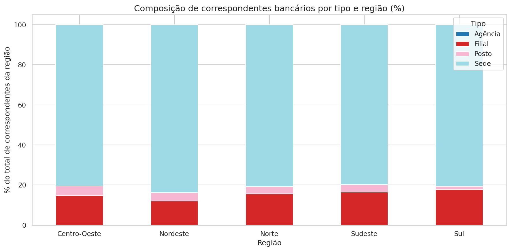

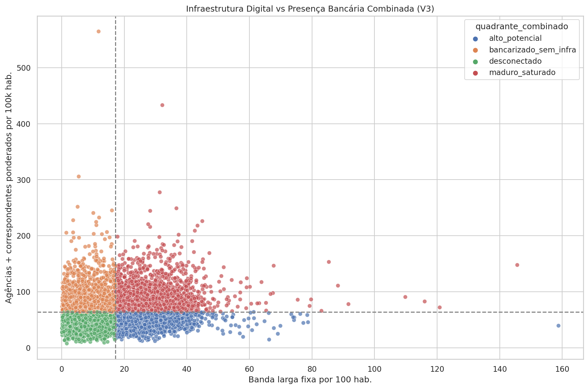


---

## 7. Integração e cálculo alpha do IPB

### 7.1 Metodologia do IPB alpha

Para cada pilar, as variáveis foram:

1. **Winsorizadas** no percentil 1% e 99%.
2. **Normalizadas** para [0, 1] via min-max.
3. As variáveis do pilar D (gap bancário) foram **invertidas** (quanto menor a infraestrutura bancária tradicional, maior o potencial).

Cada pilar foi calculado como a média simples das variáveis normalizadas. O IPB alpha é a média geométrica dos 5 pilares × 100:

```
IPB_alpha = (A × B × C × D × E)^(1/5) × 100
```

### 7.2 Resultados

- **Média do IPB alpha**: 35,85
- **Mediana do IPB alpha**: 35,86

#### Top 10 municípios no ranking alpha

| Rank | Município | UF | IPB Alpha |
|------|-----------|----|-----------|
| 1 | Barueri | SP | 82,54 |
| 2 | Itapema | SC | 82,24 |
| 3 | Balneário Camboriú | SC | 81,81 |
| 4 | Paulínia | SP | 80,87 |
| 5 | Itajaí | SC | 80,05 |
| 6 | Ilhabela | SP | 79,87 |
| 7 | Nova Lima | MG | 79,85 |
| 8 | Itupeva | SP | 79,15 |
| 9 | Santa Carmem | MT | 78,93 |
| 10 | Nova Mutum | MT | 78,80 |

#### Bottom 10

Municípios com IPB alpha igual a 0 estão majoritariamente em Alagoas e Acre. Esses casos indicam municípios com dados zerados em pelo menos um pilar após winsorização (geralmente Pix ou Estban).

#### Impacto da correção do Pix no ranking

Apesar da redução de **87%** no volume Pix, a média e a mediana do IPB *alpha* praticamente não se alteraram (35,83 → 35,85). Isso ocorre porque a normalização min-max comprime a escala e os outros pilares compensam parcialmente a queda do Pilar B/C.

No entanto, houve movimentação significativa em posições individuais:

- **Maior subida**: Piau (MG) subiu **209 posições** (3.353 → 3.144);
- **Maior queda**: Tigrinhos (SC) caiu **256 posições** (3.635 → 3.891);
- **Top 100**: apenas 1 município saiu (Foz do Iguaçu/PR) e 1 entrou (Tapurah/MT).

O Top 10 permaneceu bastante estável, com pequenas trocas de posição. A correção tornou o ranking mais confiável, embora a estrutura geral ainda reflita cidades ricas e conectadas.

### 7.3 Figuras relevantes


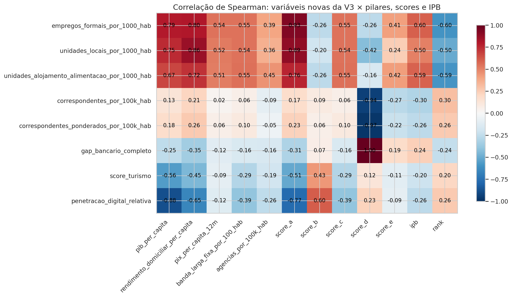


#### Leitura das correlações das novas variáveis (Spearman)

- **Empregos formais por 1000 hab.** (CEMPRE) corrige bem com riqueza e dinamismo: ρ = 0,79 com PIB per capita, 0,54 com Pix per capita e 0,93 com o score do pilar A — captura formalização que o PIB per capita sub-declara, validando sua entrada no pilar A da V3.
- **Unidades de alojamento/alimentação por 1000 hab.** têm correlação negativa com o rank da V3 (ρ = −0,59): municípios com densidade alta de hospedagem/alimentação tendem a ranquear melhor, validando o uso do setor como proxy objetivo de turismo.
- **Correspondentes por 100k hab. × agências por 100k hab.: ρ = −0,09** — as duas presenças não se movem juntas: correspondentes compensam justamente onde não há agência, reforçando a necessidade da presença combinada do pilar D da V3 (correspondentes ponderados × `gap_bancario_completo`: ρ = −0,97, forte por construção).
- `score_turismo` × PIB per capita: ρ = −0,56 (a heurística realmente seleciona cidades pobres com Pix alto); `penetracao_digital_relativa` × Pix per capita: ρ = −0,12 (fraca, como esperado para uma razão normalizadora).

---

## 8. Comparação das três abordagens do IPB (publicadas em produção)

A EDA do IPB *alpha* (seção 7) revelou o viés central do índice: um ranking de riqueza, não de oportunidade. A partir desse diagnóstico, a evolução do método seguiu uma cadeia documentada:

1. **Diagnóstico** (esta EDA, seção 7): Pilar D redundante (corr 0,88–0,91) e sem força para contrabalançar renda; normalização min-max dilui o gap.
2. **V2 — Recalibrado**: abordagem rápida anti-viés (ajuste de pesos e de variáveis com os dados atuais): pesos diferenciados, Pilar D simplificado e feature `tensao_digital_bancaria`.
3. **Gap analysis** (durante a EDA): agências sozinhas não medem mais acesso — o BCB registra 216 mil correspondentes — motivando o redesenho do Pilar D.
4. **V3 — Presença Bancária Completa** (ex-"Abordagem 2"): correspondentes bancários por tipo + heurísticas anti-turismo + `penetracao_digital_relativa`.
5. **Enriquecimento CEMPRE (2026-09)**: `empregos_formais_por_1000_hab` (pessoal ocupado total, CEMPRE/SIDRA 9528) entra no Pilar A da V3 — folha de pagamento formal é o gancho produtivo nº 1 de banco/fintech e captura formalização que o PIB per capita sub-declara.

As três versões foram calculadas pelo módulo `src/analytics/ipb.py` (fórmulas testadas em `tests/unit/test_ipb.py`), publicadas em 4 tabelas no BigQuery por `scripts/07_publica_ipb_bigquery.py` e validadas por `tests/data_quality/test_analytics_ipb.py`. A `trusted_municipios` **não** carrega colunas de índice — o IPB é produto da camada `analytics_`, não dado limpo. A comparação completa das três versões, com tabelas de Top 10/Top 100 e distribuição regional, está em `docs/Comparacao_Tres_Abordagens_IPB.md` (regenerado automaticamente pelo script 07).

### 8.1 As três estratégias

| Versão | Tabela | O que muda em relação à anterior |
|---|---|---|
| **V1 — IPB Clássico** | `analytics_ipb_v1_classico` | Fórmula original: 5 pilares, pesos iguais (média geométrica). |
| **V2 — IPB Recalibrado** | `analytics_ipb_v2_recalibrado` | Pesos A=0,5 / B=0,75 / C=0,75 / D=1,5 / E=1,0; Pilar D só com `agencias_por_100k_hab`; Pilar E sem `populacao_urbana_pct` (redundante); feature nova `tensao_digital_bancaria` = Pix per capita / (agências por 100k + 1). |
| **V3 — Presença Bancária Completa** | `analytics_ipb_v3_presenca_completa` | Redesenho do Pilar D: `gap_bancario_completo` linear = `1 − min-max(winsorize(presença combinada))`, com presença = agências + correspondentes ponderados por 100k (correspondentes do BCB por tipo: posto 1,0 / filial 0,7 / sede 0,4 / agência 1,0); nova feature `penetracao_digital_relativa` = Pix per capita / PIB per capita; pesos A=0,75 / B=1,0 / C=0,75 / D=1,5 / E=1,0. Pilar A enriquecido com `empregos_formais_por_1000_hab` (CEMPRE/IBGE, 2024). |

Ainda vale uma tabela de apoio `analytics_ipb_comparacao` (visão larga com os 3 IPBs e 6 ranks por município) para consultas ad hoc e para a EDA.

**Mecânica da flag de turismo (V3)** — documentada aqui por ser uma heurística de projeto:

```
score_turismo = 0,5·(Pix per capita ≥ percentil 90)
              + 0,3·(PIB per capita ≤ mediana)
              + 0,2·(estrato populacional = pequena)     → score ∈ [0, 1]
pilar B final = pilar B × (1 − 0,15 × score_turismo)     → desconto de 0% a 15%
```

Justificativa: sem dados de visitação (Embratur/MTur), usa-se o próprio comportamento transacional como proxy de fluxo não residente. Limitação declarada: mitiga, mas não elimina cidades de evento especial — Bombinhas, Balneário Camboriú e Itapema seguem no Top 10 da V3; Arraial do Cabo e Búzios (líderes da V3 hiperbólica) ficaram em 34º e 14º após a recalibração do gap.

**Origem do estrato populacional**: a classificação pequena (<50 mil) / média (50–500 mil) / grande (>500 mil) é **decisão do projeto** (seção 5.1), não classificação externa. Sua consequência direta: 4.913 municípios (88,2%) são "pequena", 616 "média" e 41 "grande". A escolha só afeta o rank *dentro* do estrato (`rank_estrato`); o ranking geral independe dela. A análise de sensibilidade (seção 8.5) testa tercis populacionais como alternativa.

### 8.2 Resultados

Estatísticas gerais (após recalibração do gap e enriquecimento CEMPRE da V3 — ver notas abaixo):

| Métrica | V1 Clássico | V2 Recalibrado | V3 Presença Completa |
|---|---|---|---|
| Média | 35,85 | 40,85 | 36,64 |
| Mediana | 35,86 | 40,65 | 36,67 |
| Máximo | 82,54 | 83,85 | 73,33 |
| Mínimo | 0,00 | 0,00 | 0,00 |

**Nota de recalibração (V3)** — a primeira versão do `gap_bancario_completo` era hiperbólica: `1 / (agências + correspondentes ponderados por 100k + 1)`. Como correspondentes chegam a centenas por 100k hab em cidades pequenas (densidade de lotéricas), o denominador explodia, o gap colapsava para ~0 e — pela média geométrica — o IPB de ~119 municípios zerava, todos empatados na última posição. A fórmula foi recalibrada para **gap linear** = `1 − min-max(winsorize(presença combinada))`, o mesmo padrão de inversão dos pilares D da V1/V2 (com teste de regressão dedicado em `tests/unit/test_ipb.py`). A direção do sinal se mantém (mais presença → menos gap), sem o colapso de escala.

**Nota de enriquecimento (V3, 2026-09)** — o Pilar A da V3 ganhou `empregos_formais_por_1000_hab` (pessoal ocupado total do CEMPRE/IBGE, ano 2024). Racional: folha de pagamento formal é o gancho produtivo nº 1 de banco/fintech (conta-salário, crédito consignado, PJ) e captura formalização que o PIB per capita sub-declara — capitais como São Luís e Belém têm massa salarial bancarizável com PIB pc mediano. O efeito foi cirúrgico: 10 trocas no Top 100, todas capitais/polos formais entrando (São Luís 132→70, Belém 149→99, Rio Branco 146→86, Porto Velho 138→78, Fortaleza 126→75, Boa Vista 120→80, + Montes Claros, Guarulhos, Patos de Minas, Gramado) e dormitórios de baixa formalização saindo (Valparaíso de Goiás 68→101, Mário Campos, Florestal, Canarana-MT). Cidades conhecidas estáveis (São Paulo 18→15, Florianópolis 11→9, Campinas 44→48).

Correlação de Spearman entre os rankings: **V1×V2 = 0,842**, **V2×V3 = 0,846**, **V1×V3 = 0,840**. Leitura honesta: com o gap hiperbólico, a V3 parecia reordenar drasticamente (V1×V3 = 0,654) — boa parte desse efeito era artefato de calibração, não sinal. Com o gap linear e o enriquecimento CEMPRE, as três versões continuam concordando em ~85% das posições; o que separa a V3 é o eixo concorrência (presença completa vs só agências) e a dimensão PJ (formalização), não uma revolução no ranking.

Movimentação no Top 100: V1→V2 trocam 40 cidades; V2→V3 trocam 39; V1→V3 trocam 39.

Top 10 da V3 (a versão candidata a oficial): Bombinhas-SC (73,33), Nova Lima-MG (72,41), Confins-MG (71,97), Balneário Camboriú-SC (71,00), Eusébio-CE (70,65), Itapema-SC (70,39), Palmas-TO (70,27), Santana de Parnaíba-SP (70,19), Florianópolis-SC (68,85), Santa Rita do Trivelato-MT (68,74). Os Top 10s completos por versão estão em `docs/Comparacao_Tres_Abordagens_IPB.md`.

Distribuição regional do Top 100 (V1 → V3): Sudeste 48 → 52, Sul 24 → 20, Centro-Oeste 22 → 13, Nordeste 4 → 8, Norte 2 → 7. A V3 mantém o centro de gravidade no Sudeste, dilui CO/Sul (agro/riqueza) e sobe Nordeste/Norte — efeito direto do enriquecimento CEMPRE, que valoriza capitais e polos formais dessas regiões.

### 8.3 Alertas e sensibilidade

- **Turismo**: o Top 10 da V3 segue com cidades de evento especial (Bombinhas, Balneário Camboriú, Itapema — litoral catarinense turístico). A flag reduz o pilar B em até 15%; é mitigação, não solução (ver figura abaixo).
- **Estrato populacional**: comparando a posição relativa no estrato oficial vs em tercis populacionais, ρ de Spearman = 0,890 — a classificação não revoluciona posições, mas os Top 20 de cada grupo mudam bastante (ex.: nenhuma das 20 maiores cidades líderes oficiais aparece no Top 20 do tercil superior). Manter ou revisar a classificação é **decisão de negócio documentada**, com evidências no notebook 05.
- **Município extinto**: a base de correspondentes cobre 5.571 municípios; o código extra é **Boa Esperança do Norte/MT (5101837), município extinto** que consta no cadastro do BCB mas não no Censo 2022. O pipeline usa left join a partir da trusted (5.570) e o caso é coberto por teste de integridade.
- **Correspondentes**: a fonte oficial é a API OData do BCB (`Informes_Correspondentes`, posição 30/08/2026), coletada pelo ingestor `src/ingestors/bcb_correspondentes.py` com cache idempotente. A ponderação por tipo (posto 1,0 / filial 0,7 / sede 0,4 / agência 1,0) é uma primeira aproximação a validar com negócio.

### 8.4 Figuras

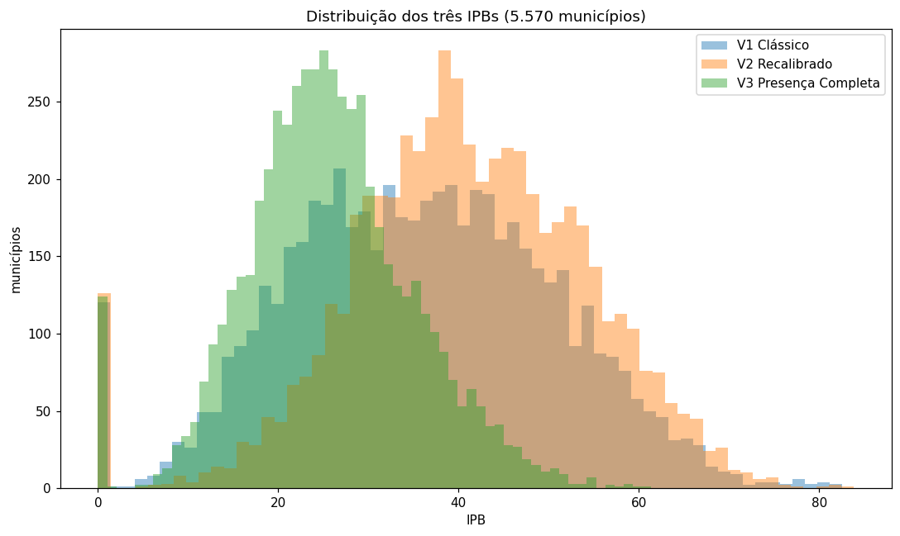

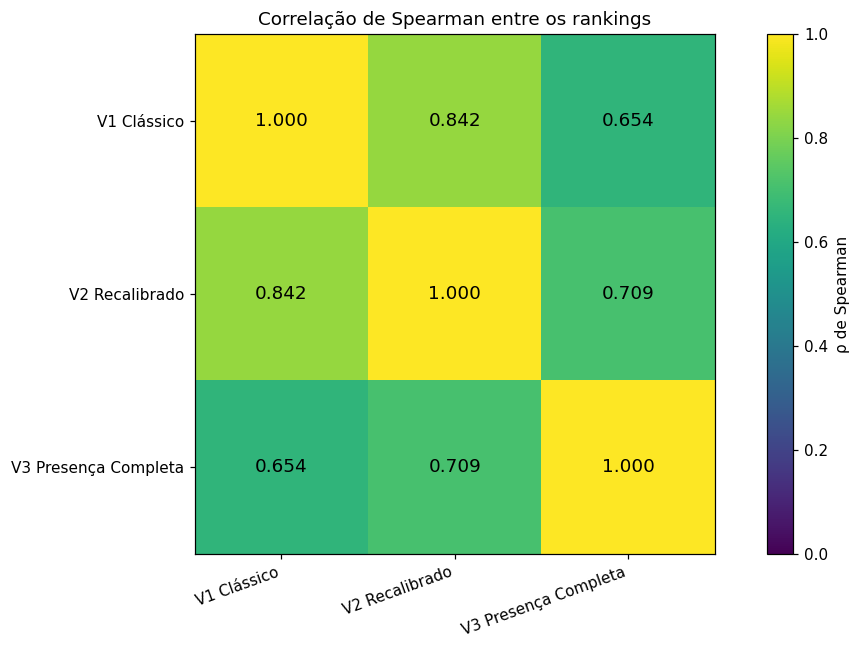

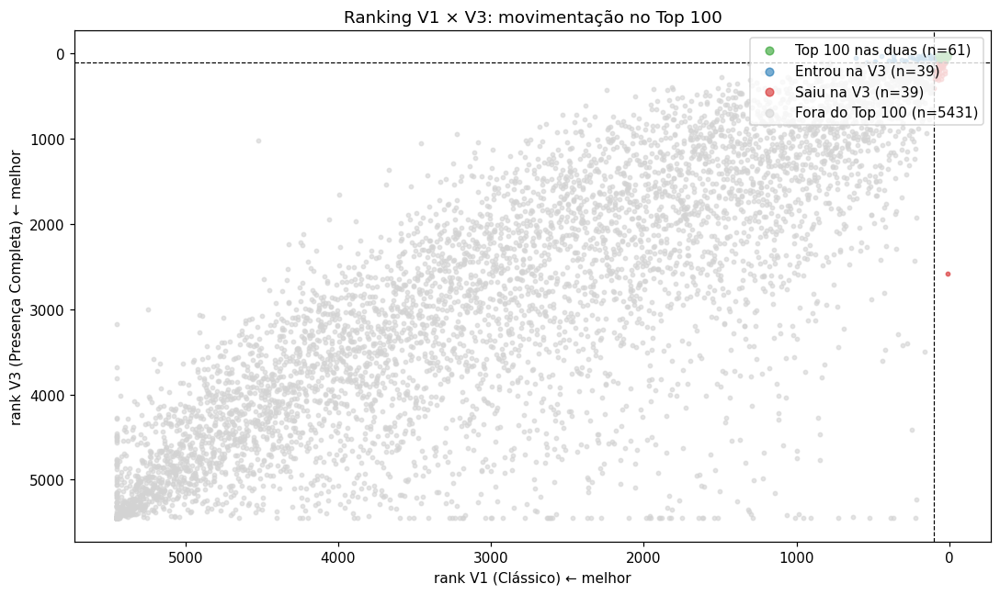

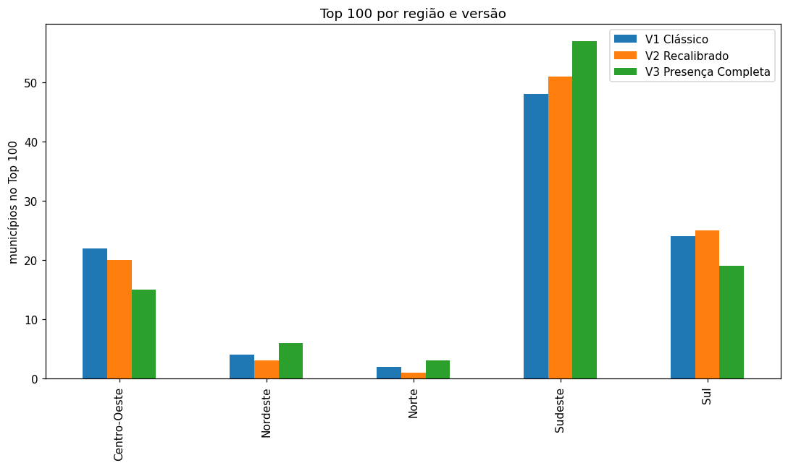

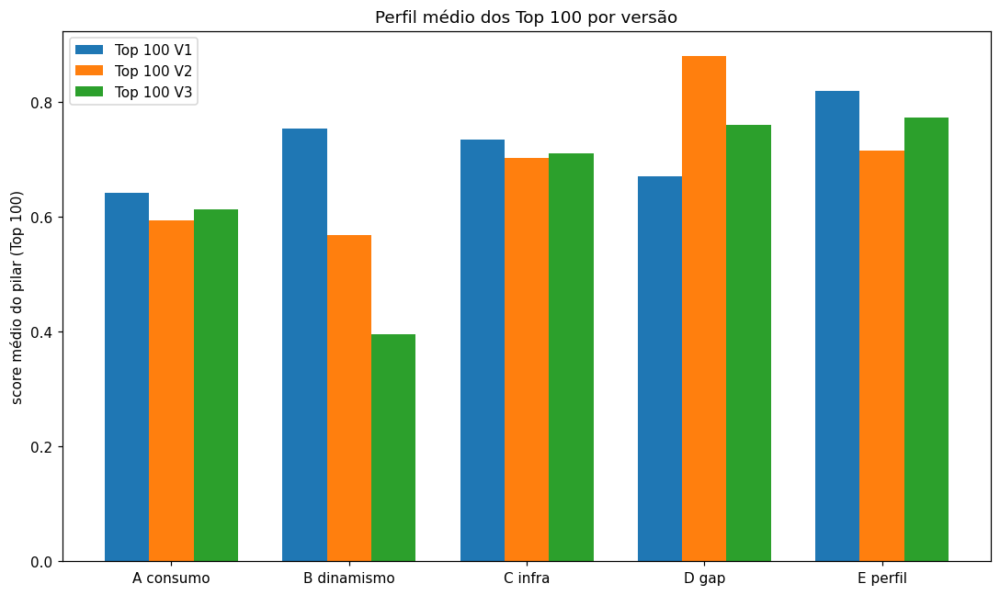

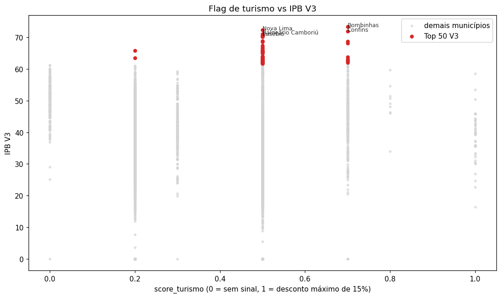

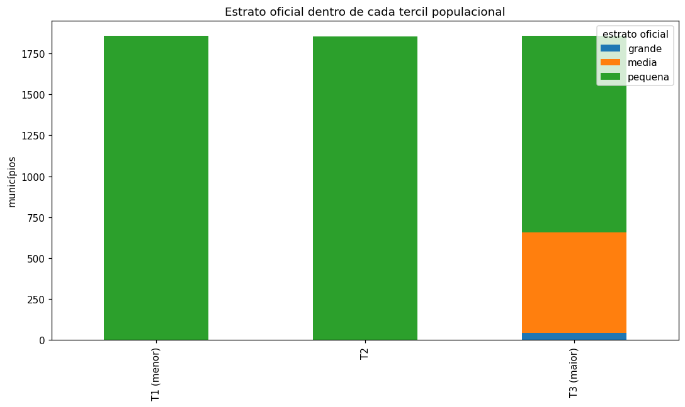

---

## 9. Features adicionais criadas

A partir das tabelas `raw_*`, foram criadas as seguintes features na base enriquecida `trusted_municipios_eda.parquet`:

| Feature | Descrição |
|---------|-----------|
| `pix_pj_pct` | Proporção do volume Pix de pessoas jurídicas. |
| `pix_ticket_medio` | Valor médio por transação Pix. |
| `flag_sem_agencia` | Indicador de município sem agência bancária. |
| `estrato_populacional` | pequena (< 50k), média (50k–500k), grande (> 500k). |
| `depositos_por_agencia` | Volume de depósitos por agência. |
| `credito_por_agencia` | Volume de crédito por agência. |

As features do CEMPRE (`empregos_formais`, `unidades_locais`, `empregos_formais_por_1000_hab`, `unidades_locais_por_1000_hab`, `unidades_alojamento_alimentacao_por_1000_hab`) foram agregadas do `raw_ibge_cempre` diretamente na camada `analytics_` (tabela `analytics_ipb_v3_presenca_completa`), por serem insumo exclusivo da V3 — não entram em `trusted_municipios_eda`.

---

## 10. Limitações e ressalvas

1. **Vintage misto**: a base combina Censo 2022, PIB 2023, Pix 2025–2026, Anatel/Estban 2026, Correspondentes BCB 30/08/2026, CEMPRE 2024 e IDHM 2010. Isso deve ser declarado na apresentação final.
2. **Internet domiciliar**: a coluna `domicilios_com_internet_pct` está 100% nula; usamos banda larga fixa como proxy.
3. **Pix**: os dados brutos do BCB incluem PF e PJ, mas o cálculo da `trusted_municipios` utiliza apenas `VL_PagadorPF`/`QT_PagadorPF` como proxy de adoção digital. Uma versão futura pode testar incluir PJ e/ou variáveis de recebedores.
4. **Efeito polo regional**: municípios dormitório podem parecer desatendidos porque recursos financeiros fluem para cidades próximas.
5. **Municípios com IPB zero**: indicam ausência de dados em algum pilar; devem ser analisados caso a caso.
6. **IPB = 0 estrutural**: município com qualquer pilar = 0 tem IPB 0 (média geométrica). Nas 3 versões a proporção de zerados é semelhante (V1: 120, V2: 126, V3: 119 municípios) — propriedade do método (min-max + média geométrica), não bug da V3. Suavização (ex.: epsilon) ficou como decisão de método futura.
7. **Flag de turismo é heurística**: Pix alto + PIB baixo + cidade pequena, por ausência de dados de visitação; desconto máximo de 15% no pilar B.
8. **Correspondentes como proxy de acesso**: a ponderação por tipo é uma primeira aproximação; e a base inclui o município extinto Boa Esperança do Norte/MT (excluído via left join na trusted).

---

## 11. Próximos passos

1. **Validar os Top 100 da V3 com conhecimento de negócio** e decidir a versão oficial do índice.
2. **Decidir a classificação por estrato** com base na análise de sensibilidade (seção 8.3) — manter as faixas atuais ou adotar tercis.
3. **Explorar clusterização (opcional)**: aplicar K-Means nos pilares para criar arquétipos de municípios.
4. **Construir visualizações executivas**: mapas, quadrantes e fichas de municípios.
5. **Definir ondas de expansão**: Top 50, Top 100, etc.
6. **Enriquecimentos futuros**: cobertura 4G/5G (pilar C), CNPJ/MEI e Caged (modelo residual / Abordagem 3), dados de visitação para refinar a flag de turismo.

---

## 12. Como reproduzir

```bash
# 1. Re-executar o Pix (12 meses)
poetry run python -m src.ingestors.bcb_pix

# 2. Re-executar a trusted
poetry run python -m src.preparacao.trusted_municipios

# 3. (Re)publicar as 3 versões do IPB no BigQuery
#    (lê trusted + raw_bcb_correspondentes + raw_ibge_cempre do BQ,
#     calcula V1/V2/V3, sobe analytics_ipb_* e regenera
#     docs/Comparacao_Tres_Abordagens_IPB.md)
poetry run python scripts/07_publica_ipb_bigquery.py

# 4. Executar os notebooks (inclui o 05, que lê as tabelas do BigQuery)
poetry run jupyter nbconvert --to notebook --execute notebooks/00_exploracao/*.ipynb
```

Testes: `poetry run pytest` (unitários + integridade das tabelas `analytics_ipb_*` + conexão BQ).

---

*Relatório gerado automaticamente a partir dos notebooks de EDA do IPB.*
