# Relatório de Análise Exploratória de Dados — IPB

> **Projeto**: Índice de Potencial Bancário (IPB)  
> **Etapa**: 2 — Análise Exploratória e Limpeza  
> **Base**: `trusted_municipios` (5.570 municípios)  
> **Período de referência**: Censo 2022, PIB 2023, Pix jul/2025–jun/2026, Anatel/Estban 2026, IDHM 2010  
> **Gerado em**: 2026-08-26

---

## 1. Objetivo

Este relatório consolida os principais achados da análise exploratória de dados (EDA) do IPB. A EDA teve como propósito:

- Avaliar a qualidade da base `trusted_municipios`.
- Explorar as tabelas `raw_*` para validar a construção da camada trusted.
- Identificar padrões, outliers e correlações entre os 5 pilares do índice.
- Calcular uma versão alpha do IPB e gerar um ranking inicial de municípios.

---

## 2. Base de dados e método

A análise foi conduzida em 6 notebooks reprodutíveis localizados em `notebooks/00_exploracao/`:

| Notebook | Propósito |
|----------|-----------|
| `00_setup_e_qualidade.ipynb` | Validação de qualidade da `trusted_municipios`. |
| `00b_auditoria_raws_e_features.ipynb` | Auditoria das tabelas `raw_*` e engenharia de features. |
| `01_perfil_demografico_e_geo.ipynb` | Análise do pilar E (perfil demográfico). |
| `02_economia_e_dinamismo.ipynb` | Análise dos pilares A e B (renda, PIB, Pix). |
| `03_infra_digital_e_gap_bancario.ipynb` | Análise dos pilares C e D (banda larga, agências). |
| `04_integracao_correlacoes.ipynb` | Correlações, PCA e cálculo alpha do IPB. |

Os outputs de dados (parquet e relatórios JSON) foram salvos em `data/processed/`.  
As figuras geradas pela EDA foram salvas em `docs/assets/figures/` para ficarem versionadas junto com este relatório.

### 2.1 Recálculo do Pix

Durante a EDA, identificou-se que o ingestor `bcb_pix.py` havia coletado apenas **1 mês** de dados (`202312`) em sua execução inicial. Para refletir melhor a dinâmica financeira real, o ingestor foi re-executado para os **últimos 12 meses** (jul/2025 a jun/2026), totalizando **568.236 registros** brutos. A `trusted_municipios` foi recalculada com essa nova série.

---

## 3. Qualidade dos dados

A base `trusted_municipios` possui **5.570 municípios** e **26 colunas**, com `id_municipio` como chave primária única.

### 3.1 Nulos e gaps conhecidos

| Coluna | % Nulos | Observação |
|--------|---------|------------|
| `domicilios_com_internet_pct` | 100% | API do SIDRA indisponível para `N6[all]`; usa-se `banda_larga_fixa_por_100_hab` como proxy. |
| `idhm` | 0,11% | Vintage 2010; mantido como referência histórica. |
| `quantidade_agencias` | 0% | Municípios sem agência foram imputados com 0. |

Todas as regras de negócio validadas passaram:

- `populacao_total > 0` ✅
- `pib_per_capita > 0` ✅
- Percentuais entre 0 e 100 ✅
- `quantidade_agencias >= 0` ✅

### 3.2 Figuras relevantes

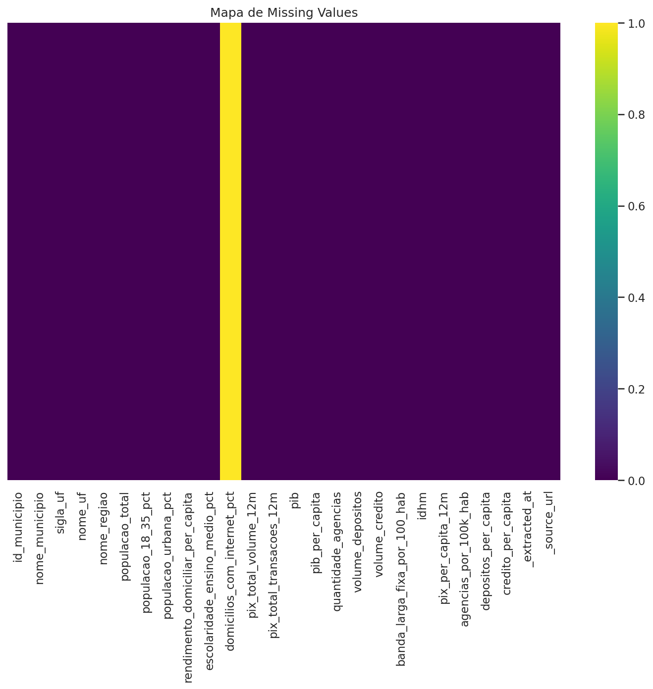

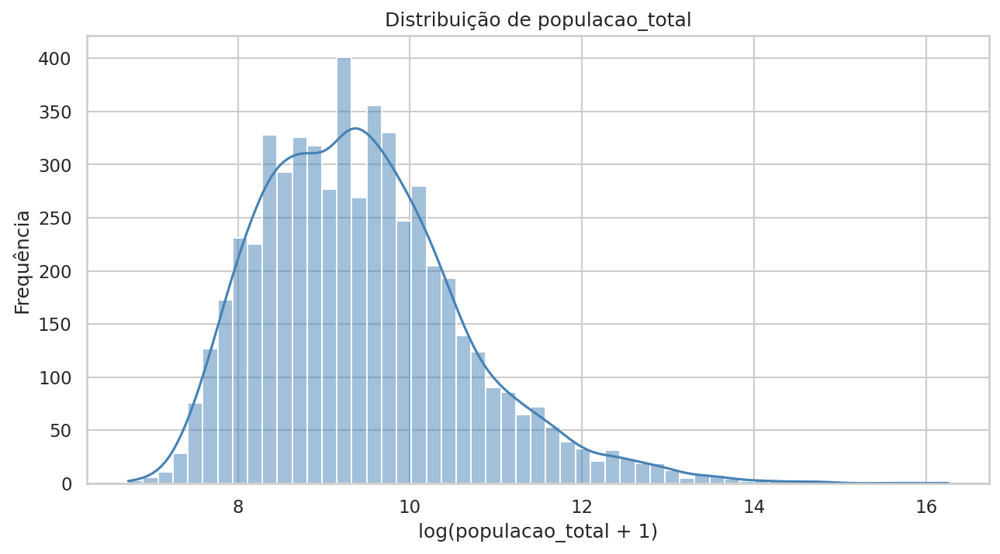

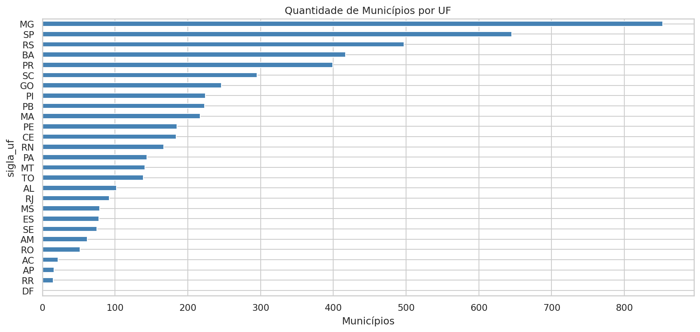

---

## 4. Perfil demográfico e geográfico (Pilar E)

### 4.1 Principais achados

- **Escolaridade**: Sudeste lidera com 44,35% da população 18+ com ensino médio completo; Nordeste tem o menor índice (33,95%).
- **Urbanização**: Sudeste (78,94%) e Centro-Oeste (76,2%) são as regiões mais urbanizadas; Nordeste (60,98%) e Norte (62,83%) são as menos urbanizadas.
- **População jovem (18–35)**: Norte tem a maior proporção (27,81%), seguido do Nordeste (26,85%).
- **1.098 municípios** apresentam perfil simultaneamente jovem, urbano e escolarizado acima da mediana.

### 4.2 Figuras relevantes

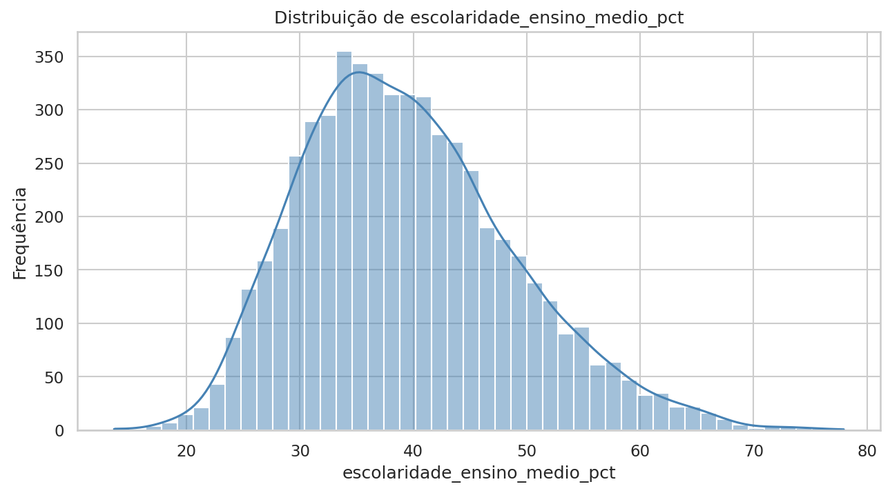

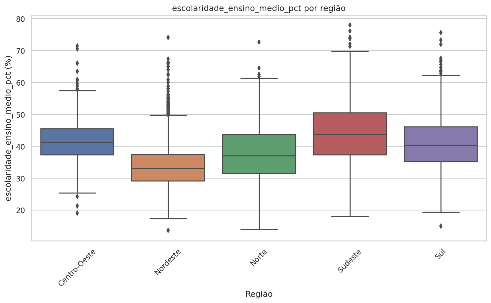

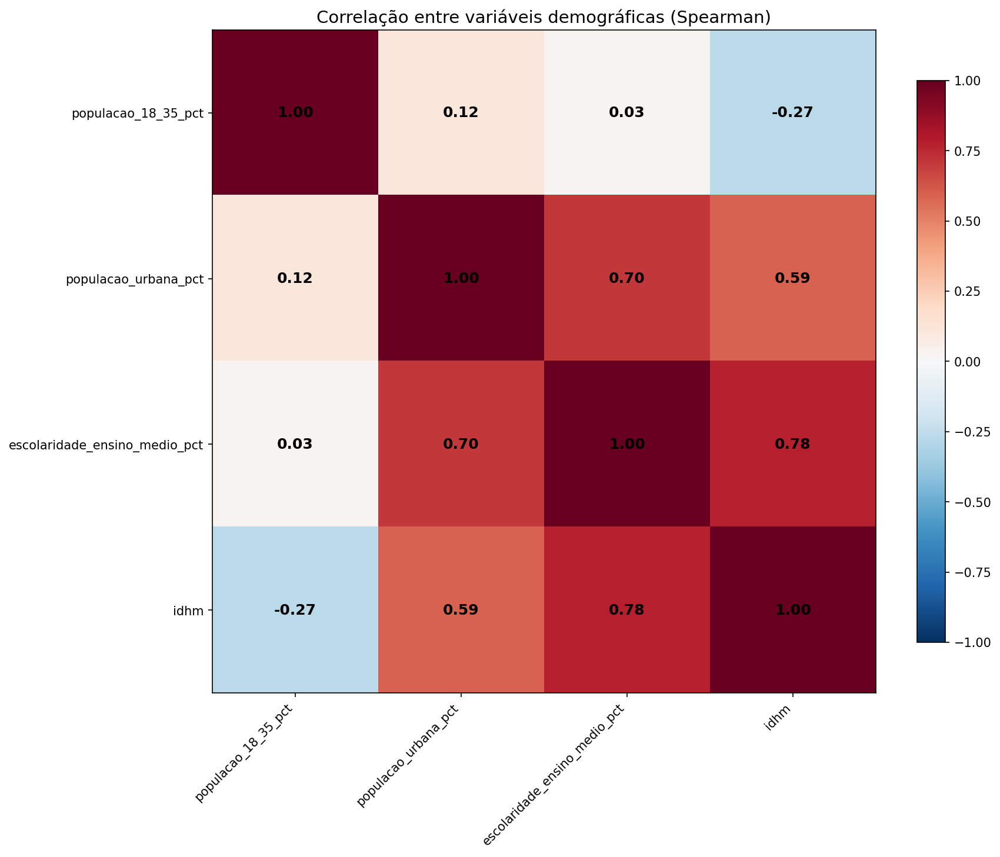

---

## 5. Capacidade de consumo e dinamismo (Pilares A e B)

### 5.1 Principais achados

- **Renda e PIB**: cidades grandes apresentam renda domiciliar per capita mediana de R$ 2.079,68 e PIB per capita de R$ 56.227,29; cidades pequenas ficam com R$ 1.145,36 e R$ 28.216,86, respectivamente.
- **Pix per capita (12 meses)**: cresce conforme o estrato populacional — pequenas R$ 348.814, médias R$ 478.673, grandes R$ 645.788.
- **859 municípios** apresentam alta adoção Pix (acima da mediana) e renda abaixo da mediana, indicando potencial de inclusão financeira digital.
- A série temporal do Pix mostra concentração crescente de volume em meses recentes.

### 5.2 Figuras relevantes

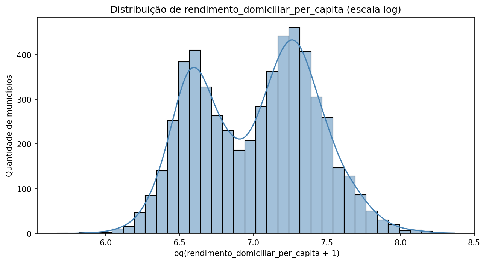

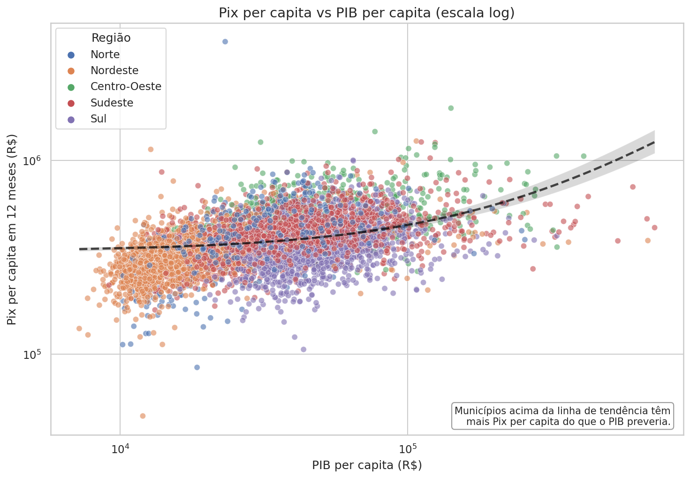

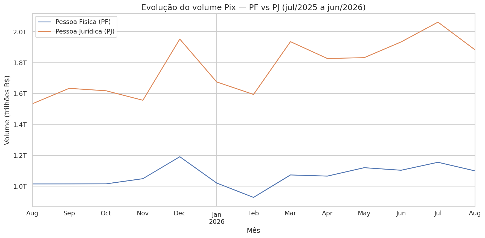

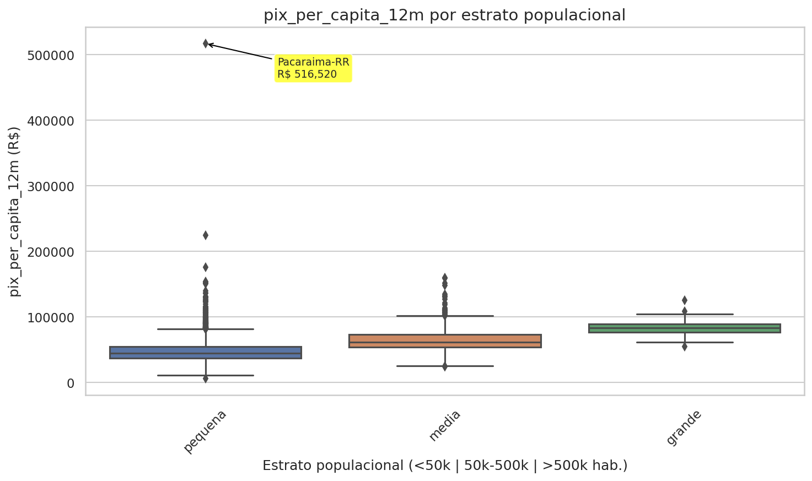

---

## 6. Infraestrutura digital e gap bancário (Pilares C e D)

### 6.1 Principais achados

- **Municípios sem agência bancária**: **2.656 municípios (47,68%)** não possuem agência bancária ativa.
- **UFs com maior gap**: Piauí (82,1%), Tocantins (80,6%), Paraíba (79,8%), Rio Grande do Norte (77,2%) e Roraima (66,7%).
- **Quadrantes (banda larga × agências)**:
  - **Alto potencial**: 1.050 municípios (banda larga alta + poucas agências).
  - **Maduro saturado**: 1.735 municípios (banda larga alta + muitas agências).
  - **Desconectado**: 1.735 municípios (banda larga baixa + poucas agências).
  - **Bancarizado sem infra**: 1.050 municípios (banda larga baixa + muitas agências).

### 6.2 Figuras relevantes

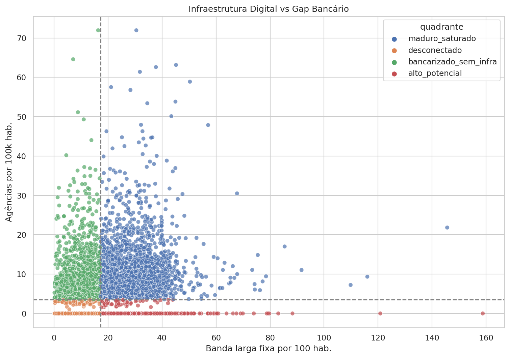

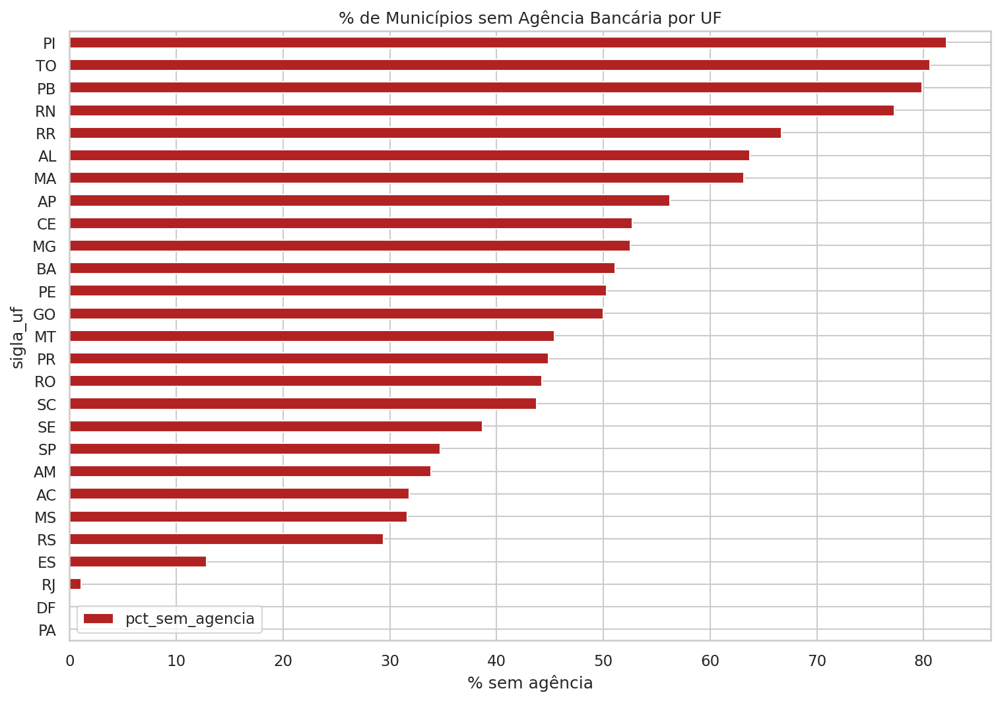

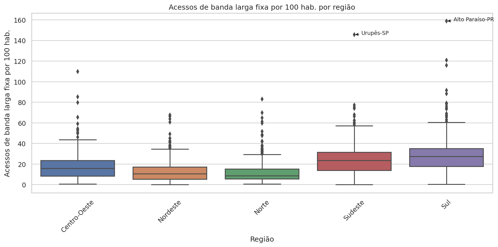

---

## 7. Integração e cálculo alpha do IPB

### 7.1 Metodologia do IPB alpha

Para cada pilar, as variáveis foram:

1. **Winsorizadas** no percentil 1% e 99%.
2. **Normalizadas** para [0, 1] via min-max.
3. As variáveis do pilar D (gap bancário) foram **invertidas** (quanto menor a infraestrutura bancária tradicional, maior o potencial).

Cada pilar foi calculado como a média simples das variáveis normalizadas. O IPB alpha é a média geométrica dos 5 pilares × 100:

```
IPB_alpha = (A × B × C × D × E)^(1/5) × 100
```

### 7.2 Resultados

- **Média do IPB alpha**: 35,83
- **Mediana do IPB alpha**: 35,83
- **Variância explicada pelos 2 primeiros componentes PCA**: 70,49%

#### Top 10 municípios no ranking alpha

| Rank | Município | UF | IPB Alpha |
|------|-----------|----|-----------|
| 1 | Barueri | SP | 82,50 |
| 2 | Itapema | SC | 82,23 |
| 3 | Balneário Camboriú | SC | 81,81 |
| 4 | Paulínia | SP | 80,91 |
| 5 | Itajaí | SC | 80,05 |
| 6 | Nova Lima | MG | 79,85 |
| 7 | Ilhabela | SP | 79,74 |
| 8 | Itupeva | SP | 79,20 |
| 9 | Nova Mutum | MT | 78,63 |
| 10 | Santa Carmem | MT | 78,52 |

#### Bottom 10

Municípios com IPB alpha igual a 0 estão majoritariamente em Alagoas e Acre. Esses casos indicam municípios com dados zerados em pelo menos um pilar após winsorização (geralmente Pix ou Estban).

### 7.3 Figuras relevantes

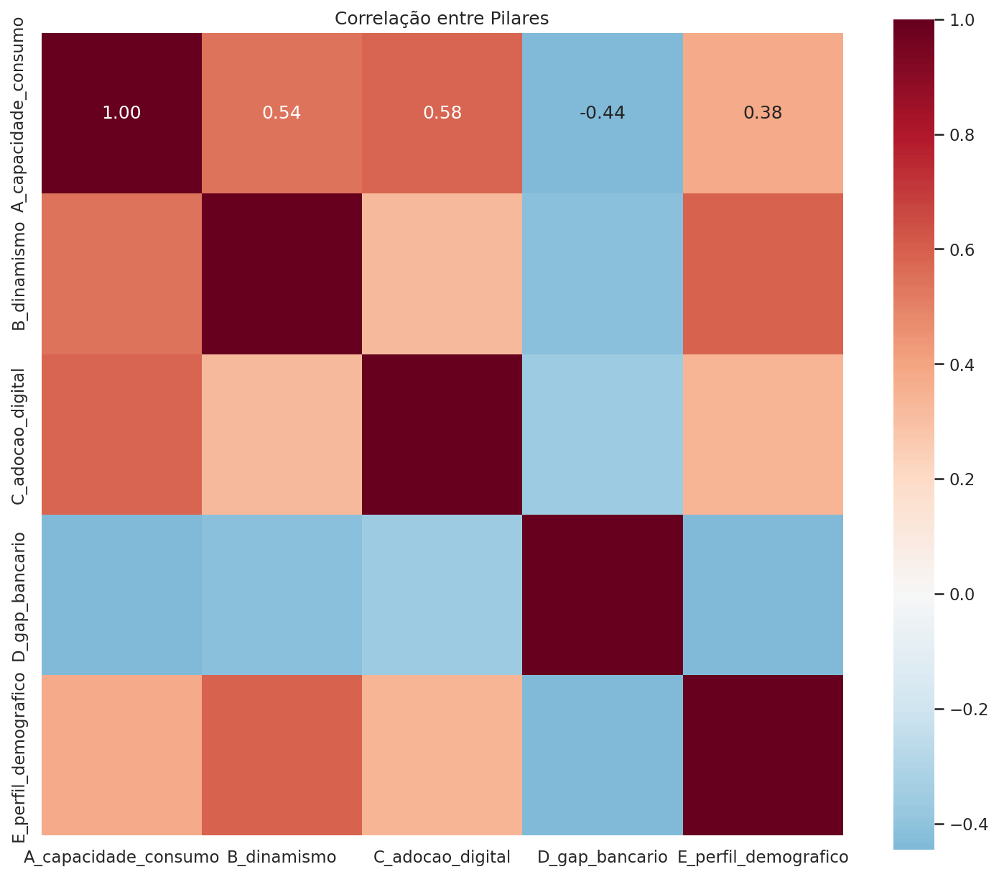

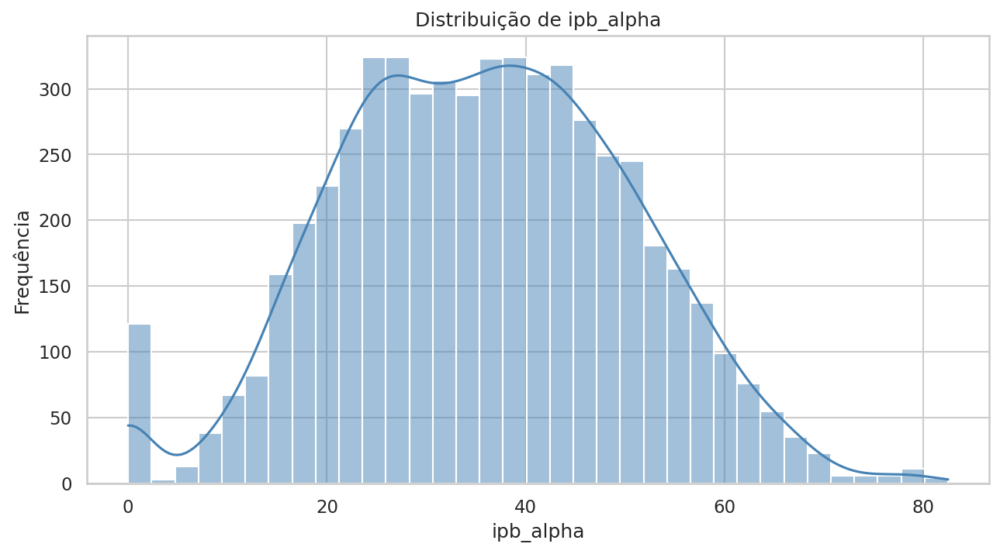

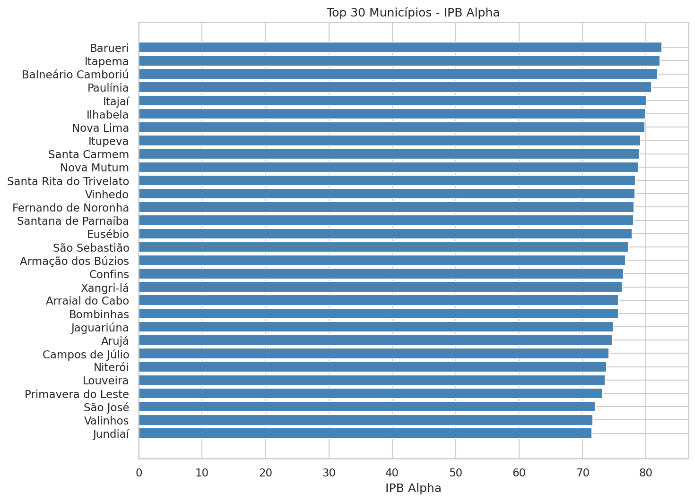

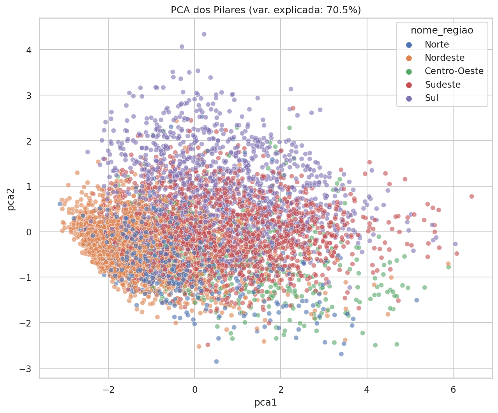

---

## 8. Features adicionais criadas

A partir das tabelas `raw_*`, foram criadas as seguintes features na base enriquecida `trusted_municipios_eda.parquet`:

| Feature | Descrição |
|---------|-----------|
| `pix_pj_pct` | Proporção do volume Pix de pessoas jurídicas. |
| `pix_ticket_medio` | Valor médio por transação Pix. |
| `flag_sem_agencia` | Indicador de município sem agência bancária. |
| `estrato_populacional` | pequena (< 50k), média (50k–500k), grande (> 500k). |
| `depositos_por_agencia` | Volume de depósitos por agência. |
| `credito_por_agencia` | Volume de crédito por agência. |

---

## 9. Limitações e ressalvas

1. **Vintage misto**: a base combina Censo 2022, PIB 2023, Pix 2025–2026, Anatel/Estban 2026 e IDHM 2010. Isso deve ser declarado na apresentação final.
2. **Internet domiciliar**: a coluna `domicilios_com_internet_pct` está 100% nula; usamos banda larga fixa como proxy.
3. **Pix**: o cálculo da trusted utiliza apenas `VL_PagadorPF`/`QT_PagadorPF`. Uma versão futura pode incorporar PJ e recebedores.
4. **Efeito polo regional**: municípios dormitório podem parecer desatendidos porque recursos financeiros fluem para cidades próximas.
5. **Municípios com IPB zero**: indicam ausência de dados em algum pilar; devem ser analisados caso a caso.

---

## 10. Próximos passos

1. **Refinar a fórmula do IPB**: testar cenários de pesos e sensibilidade do ranking.
2. **Explorar clusterização (opcional)**: aplicar K-Means nos pilares para criar arquétipos de municípios.
3. **Construir visualizações executivas**: mapas, quadrantes e fichas de municípios.
4. **Definir ondas de expansão**: Top 50, Top 100, etc.

---

## 11. Como reproduzir

```bash
# 1. Re-executar o Pix (12 meses)
poetry run python -m src.ingestors.bcb_pix

# 2. Re-executar a trusted
poetry run python -m src.preparacao.trusted_municipios

# 3. Executar os notebooks
poetry run jupyter nbconvert --to notebook --execute notebooks/00_exploracao/*.ipynb
```

---

*Relatório gerado automaticamente a partir dos notebooks de EDA do IPB.*
