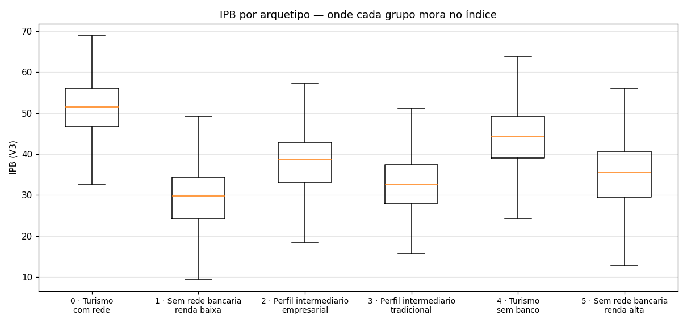
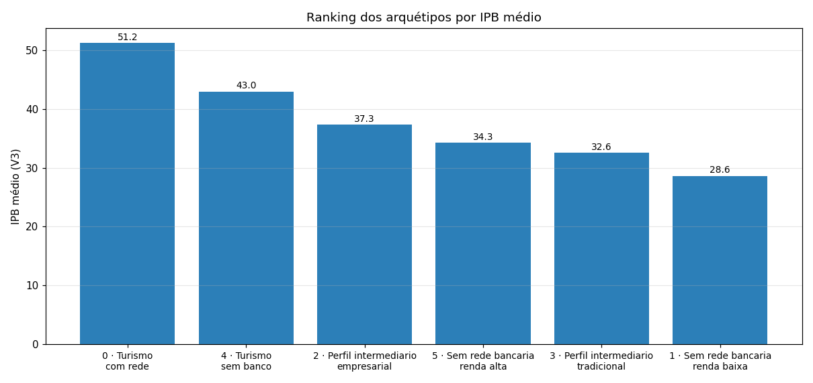
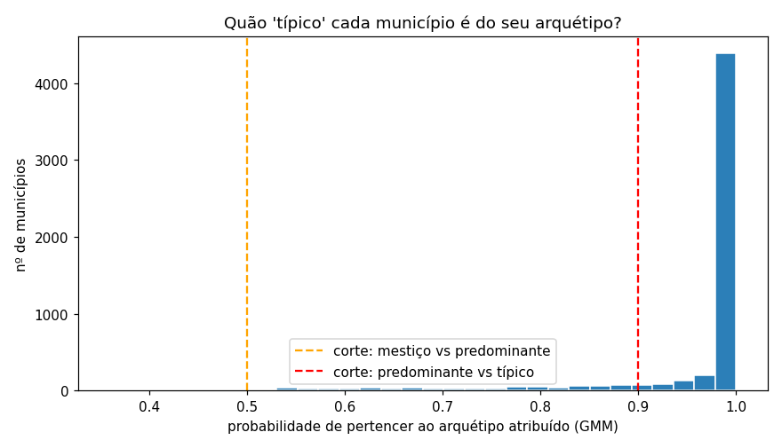
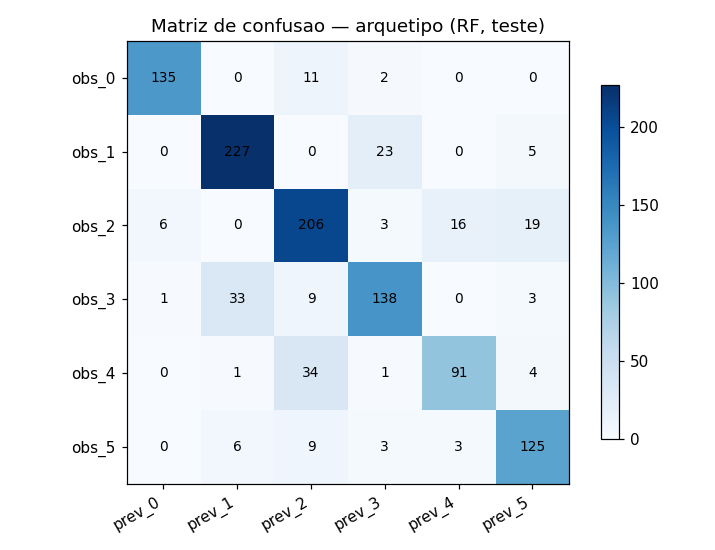
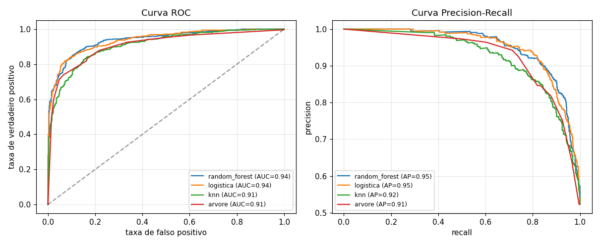
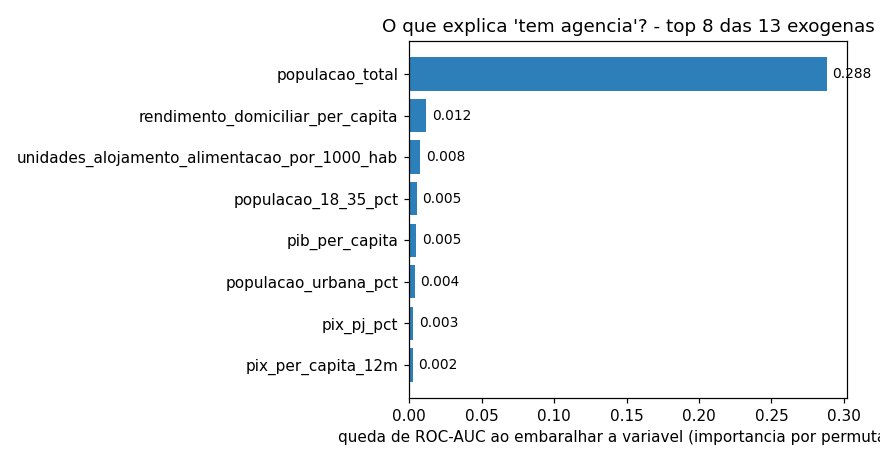
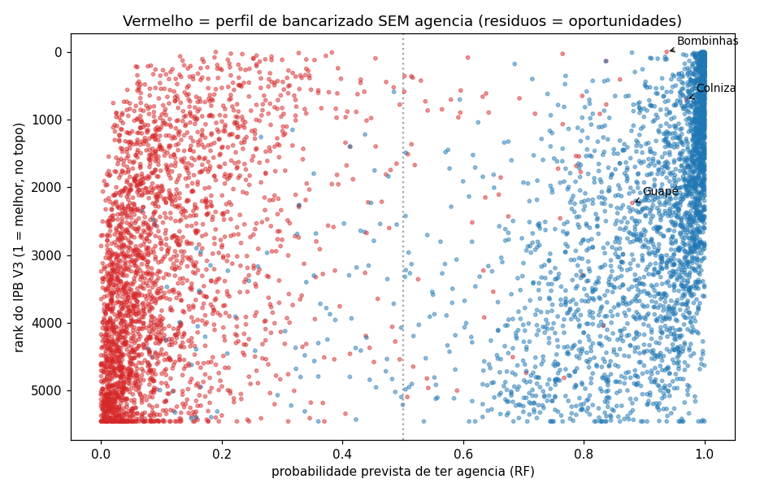
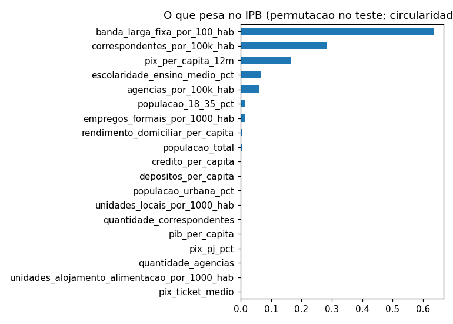
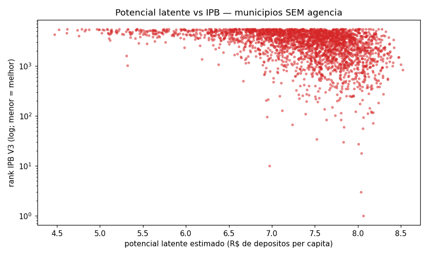
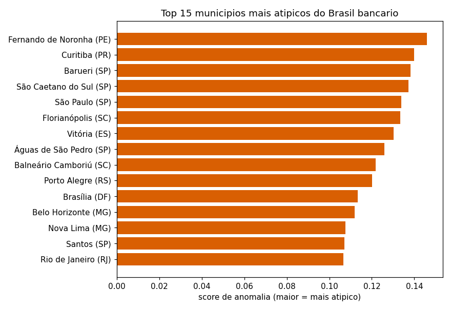

# Relatório da Etapa 3 — Modelagem (ML)

> **Data:** 2026-09-12
> **Base:** `referencias/DISCUSSAO_MODELOS_ETAPA3.md` (v2, escopo travado pelo grupo) e `docs/Plano_de_Implementacao_Etapa3_Modelagem.md`
> **Código:** módulos em `src/analytics/` (modelagem, clustering, classificacao, regressao, anomalias), experimentos em `notebooks/01_modelagem/` (3 notebooks executados), publicação em `scripts/08_publica_clusters_bigquery.py`
> **Tabela publicada:** `analytics_ipb_clusters` (5.570 municípios, integridade testada em `tests/data_quality/test_analytics_clusters.py`)
> **Stack:** somente scikit-learn (sem dependência nova, sem GPU, sem cloud — custo zero)

---

## 1. Contexto e a restrição que manda em tudo

A pergunta do projeto: *quais municípios brasileiros apresentam a melhor relação entre potencial econômico, adoção digital e oportunidade de mercado (baixa concorrência física)?*

**Não existe rótulo de verdade.** Ninguém nos disse quais municípios são "oportunidade bancária real"; não temos série de entrada/saída de agências nem conversões reais de expansão. Toda classificação/regressão desta etapa usa **alvo proxy** (substituto), e isso está declarado aqui, nos notebooks e deve estar na apresentação. Os modelos aprendem estrutura e preveem presença observada — não "descobrem a verdade".

## 2. Dataset de modelagem

`data/processed/modelagem.parquet` (gerado no notebook 01): 5.570 municípios × 19 features + 2 alvos + referência `ipb`/`rank` da V3 (cruzamento, nunca feature).

- **19 features aprovadas** (discussão v2 §3): demografia Censo 2022, PIB 2023, CEMPRE 2024, Pix 2023/24, Anatel/Estban 2026. Excluídas: colunas de índice (scores, gap, ranks), `domicilios_com_internet_pct` (100% nula), absolutos (efeito tamanho), `idhm` (vintage 2010 — teste opcional em fase 2).
- **Transformação `log1p`** nas 14 variáveis não-percentuais de cauda longa (decisão metodológica registrada no notebook 01): sem ela, `populacao_total` dominava a padronização e o K-Means isolava SP e capitais em micró-grupos (1 e 9 municípios). Com o log, clusters equilibrados e mais contrastantes.
- **13 exógenas vs 6 de presença:** `FEATURES_SEM_PRESENCA` (13 socioeconômicas + digitais) usada na classificação de presença; as 6 variáveis de presença (agências, correspondentes, depósitos, crédito) medem a estrutura instalada — ver correção nº 2 na §7.

## 3. Arquétipos — clusterização (K-Means + GMM)

**Pergunta que o IPB não responde:** não "quem tem mais potencial", mas *que tipos de municípios existem* e qual a jogada típica de cada tipo.

**Escolha do K:** tabela de métricas para K = 3…10 (silhouette, Davies-Bouldin, Calinski-Harabasz, BIC do GMM) + legibilidade de negócio. **K = 6** decidido com: silhouette 0,200 (K=3 tem 0,252, mas colapsa a narrativa em "porte da cidade" — o cluster viraria sinônimo de estrato populacional); clusters de 653 a 1.278 municípios, sem degeneração; BIC do GMM em queda. **K = 5 é a alternativa de iteração** registrada (troca-se uma constante e reexecutam-se os 3 notebooks).

**Perfil dos 6 arquétipos** (médias nos valores reais; nomes sugeridos por regra sobre os dados com desambiguação de pares repetidos — validação do grupo pendente; documentação completa, com leitura de negócio de cada grupo, em **`docs/Arquetipos_Municipais.md`**; guia de conceitos em `referencias/ML_Guia_de_Conceitos.md`, material local do grupo fora do Git):

| Cluster | Nome sugerido | n | Leitura de perfil |
|---|---|---|---|
| 0 | Turismo - com rede | 740 | Destinos turísticos grandes/populosos, ricos, alojamento ~8× a média, **já com agências** |
| 1 | Sem rede bancária - renda baixa | 1.278 | Interior pobre (~10 mil hab), baixa formalização, **100% sem agência** |
| 2 | Perfil intermediário - empresarial | 1.248 | PIB pc alto, Pix PJ 42%, empregos formais altos, agências presentes |
| 3 | Perfil intermediário - tradicional | 919 | Cidades médias (~34 mil hab), renda mediana |
| 4 | **Turismo - sem banco** | 653 | **O achado do projeto:** destinos turísticos pequenos (~6 mil hab) e ricos (PIB pc 61k), **100% sem agência** |
| 5 | Sem rede bancária - renda alta | 732 | Cidades muito pequenas (~4 mil hab), renda acima da média, 99% sem agência |

**Boxplot do IPB por cluster** — onde cada arquétipo mora no índice:

**Quão "típico" cada município é (GMM em ação):** além do grupo, o GMM entrega a **probabilidade de pertencimento** — quão confiante é a atribuição. 4.855 municípios são típicos (>90% de confiança), 705 predominantes e só 10 "mestiços" (<50%), todos cidades pequenas do interior do Nordeste na fronteira entre os perfis de baixa renda — candidatas a transição entre arquétipos (notebook 01, seção 4.1):

**Solidez dos grupos (classificador multi-classe, §4.3):** prever o arquétipo **só pelas 13 exógenas** (sem olhar a estrutura bancária) dá **F1 macro = 0,826 (RF)** e 0,825 (Logística) — os arquétipos são determinados pelo perfil da cidade, não pela presença instalada, e dá para classificar município novo sem dados bancários. (Nomes repetidos dos rascunhos iniciais — dois "Turismo", dois "Sem rede" — foram desambiguados automaticamente: ver `docs/Arquetipos_Municipais.md` §1.)

## 4. Classificação — presença bancária (alvo proxy `flag_tem_agencia`, ~52/48)

**Ressalva (decisão do grupo):** este modelo **não é o índice e não o substitui** — é complemento de validação que cruza com o IPB.

**Protocolo (a prova):** split estratificado 80/20 (seed 42), padronização ajustada só no treino, métricas no teste, tuning `GridSearchCV` 5-fold (grid pequeno: RF `n_estimators`/`max_depth`, Logística `C`). Preditoras: **13 exógenas** (ver §7, correção nº 2).

**Matriz de comparação (teste, n = 1.114):**

| Modelo | ROC-AUC | PR-AUC | F1 | Precision | Recall | Acurácia | Tempo |
|---|---|---|---|---|---|---|---|
| **Random Forest** (tunado: 400 árv., prof. 20) | **0,939** | 0,951 | 0,873 | 0,898 | 0,849 | 0,871 | 18,4 s |
| **Regressão Logística** (tunada: C=10) | **0,938** | 0,950 | 0,869 | 0,892 | 0,847 | 0,866 | 1,2 s |
| KNN (k=15, distance) | 0,909 | 0,923 | 0,842 | 0,824 | 0,861 | 0,831 | 0,03 s |
| Árvore (prof. 4) | 0,909 | 0,911 | 0,833 | 0,846 | 0,820 | 0,828 | 0,18 s |

Leitura: RF e Logística empatam no topo (a linearidade do problema favorece a Logística — cujos coeficientes são narráveis ponto a ponto); KNN fica atrás, confirmando a avaliação da discussão (§6); a Árvore entrega regras legíveis. Matriz de confusão do RF: 475 VN, 56 FP, 88 FN, 495 VP.

**Resíduos — o produto de negócio:** 56 municípios com probabilidade ≥ 0,5 de "tem agência" **mas sem agência** (perfil de bancarizado não atendido). O topo da lista valida o IPB de forma gritante: **Bombinhas-SC — rank 1 do IPB V3 — com prob 0,94**, seguida de Colniza-MT (0,97), Balneário Rincão-SC, Itapeva-MG, Taguaí-SP.

## 5. Regressão

### 5.1 Explicar o IPB (sanity check circular, declarado)

Regressão com alvo = IPB V3. O acerto é alto **por construção** (as features entram na fórmula — o modelo só decora a receita; circularidade impressa aqui e no notebook). O produto é a **importância por permutação** (queda de R² ao embaralhar cada variável), medida no teste com o Random Forest (R² = 0,938; MAE 1,9 ponto de IPB):

| Variável | Queda de R² |
|---|---|
| banda_larga_fixa_por_100_hab | **0,635** |
| correspondentes_por_100k_hab | 0,285 |
| pix_per_capita_12m | 0,167 |
| escolaridade_ensino_medio_pct | 0,068 |
| agencias_por_100k_hab | 0,059 |

**Discussão honesta:** em termos de variância explicada, o IPB V3 é hoje um índice de **banda larga fixa + correspondentes + Pix**. Isso não é defeito de código — é o que os dados dizem sobre o desenho: banda larga funciona como proxy geral de desenvolvimento urbano (correlacionada com renda, Pix, escolaridade), então concentra importância; as variáveis de renda têm importância baixa *por redundância* (sua informação já está nas outras). Fica como insumo de fase 2 para a discussão de pesos — **nenhum ajuste foi feito no índice nesta etapa**.

### 5.2 Potencial latente (o mais interessante)

Lógica "precificar imóvel": o modelo (RF sobre `log1p(depositos_per_capita)`) treina **só nos municípios com agência** e com as **13 exógenas** (sem nenhuma variável de presença), e estima quanto cada cidade **sem** agência depositaria se tivesse banco. Onde já tem agência fica nulo — não se estima o que já se observa.

- **Holdout interno (só com-agência):** R² = 0,475, MAE ≈ R$ 0,45 de depósito per capita (escala do log revertida) — moderado e honesto: depósitos locais têm componente idiossincrático que perfil de cidade não captura.
- **Validação cruzada do índice:** Spearman(potencial latente, IPB V3) nos 2.656 sem agência = **0,449** (p ≈ 6×10⁻¹³²). O IPB ordena essas cidades moderadamente alinhado com o que um modelo de dados puro estimaria — o índice captura essa dimensão, mas **metade da ordenação vem de outro lugar**: as divergências (potencial latente alto com rank ruim e vice-versa) são candidatas a investigação e materiais de discussão em banca.

## 6. Anomalias — Isolation Forest (Top 30)

Os municípios mais atípicos do Brasil bancário para leitura humana (figura e tabela no notebook 03): **Fernando de Noronha** lidera o score, seguida de Curitiba, Barueri, São Caetano do Sul, São Paulo, Florianópolis, Vitória, Águas de São Pedro…

Perfil médio do grupo vs. média nacional: 5,0× mais agências, 2,1× alojamento-alimentação/1000, ~1,9× crédito e banda larga, 1,55× escolaridade. Leitura: o detector aponta para os dois lados da anomalia — os super-bancarizados atípicos e os casos especiais (Noronha, Águas de São Pedro). Coerente com a discussão de negócio, que já usava F. de Noronha como exemplo de perfil atípico.

## 7. Correções metodológicas registradas (a execução com dados reais pegou o que os brinquedos não pegam)

1. **Cauda longa (notebook 01):** sem `log1p`, `populacao_total` gerava clusters degenerados. Transformação nas 14 variáveis não-percentuais, decisão documentada.
2. **Vazamento de preditora (notebook 02):** a primeira execução com as 19 features deu ROC-AUC = 1,0 para **todos** os modelos — `agencias_por_100k_hab`, `depositos_per_capita` e `credito_per_capita` são **consequência** do alvo (cidade sem agência não tem agência/100k nem depósito Estban). Correção: classificação de presença e classificador de arquétipos usam só as 13 exógenas; constantes `FEATURES_PRESENCA`/`FEATURES_SEM_PRESENCA` centralizadas em `src/analytics/modelagem.py` com teste travando a separação. Com a correção, ROC-AUC realista (0,94) e os resíduos voltaram a existir.
3. **Alvo degenerado (notebooks 01–02):** `flag_tem_correspondente` é 100/0 — **todos os municípios têm ao menos 1 correspondente** (rede BCB cobre o país). Vira achado de negócio (a camada de correspondentes é universal; o que discrimina é a intensidade por 100k hab, mantida como feature) e sai da matriz de classificação.

## 8. Síntese — o que cada modelo responde da pergunta do projeto

| Modelo | Pergunta respondida | Resposta em uma frase |
|---|---|---|
| Clusterização (K=6) | Que tipos de municípios existem? | 6 arquétipos com jogadas distintas, do "turismo pequeno rico sem banco" ao "interior pobre sem rede" |
| Classificação (RF/Log) | Onde o mercado já se revelou? | Presença explicada pelo perfil (ROC-AUC 0,94); os 56 falsos negativos são oportunidades não atendidas |
| Classificador de arquétipos | Os grupos são sólidos? | F1 macro 0,83 só com exógenas — arquétipo é perfil da cidade, não acidente de rede |
| Regressão explicativa | O que pesa no IPB? | Banda larga + correspondentes + Pix concentram a importância (insumo de fase 2) |
| Potencial latente | Quanto renderia se tivesse banco? | IPB alinhado moderadamente (Spearman 0,45); divergências são mapa de investigação |
| Isolation Forest | Quem foge do padrão? | Top 30 atípicos (Noronha #1) para leitura de negócio |

## 9. Limitações (declaradas)

- **Alvos proxy** — nenhum modelo foi treinado contra "oportunidade real"; os resíduos e divergências são hipóteses geradas, não verdades.
- **Vintage misto** (Censo 2022, PIB 2023, Pix 2023/24, Estban/correspondentes 2026, CEMPRE 2024) — mesma limitação do índice.
- **Classificação espacial não avaliada** (fase 2): municípios vizinhos se parecem; o holdout aleatório pode superestimar generalização.
- **GMM secundário**: silhouette do GMM fica em ~0,10 — mantido como probabilidade de pertencimento, não como agrupador principal.
- **Nomes dos arquétipos são sugestões** por regra sobre os dados — validação do grupo pendente (decisão aberta nº 2 da discussão).

## 10. Fase 2 (registrado, sem compromisso)

Validação espacial por região; PCA como validação do índice; Agglomerative/dendrograma; iteração de K (5 vs 6) e dos nomes dos arquétipos; `idhm` como feature opcional; discussão de pesos do IPB à luz da importância (§5.1); mais tuning.

---

*Entregas da rubrica: dataset de modelagem (§2), código de treinamento (módulos + notebooks), relatório (este), matriz de comparação (§4 e notebooks), gráficos (ROC/PR, matriz de confusão, importância, resíduos, silhouette, boxplots — em `data/processed/figures/`), pipeline de inferência (`analytics_ipb_clusters` + funções dos módulos com scaler/clusterizador retornados), documentação técnica (docstrings + notebooks narrados).*
