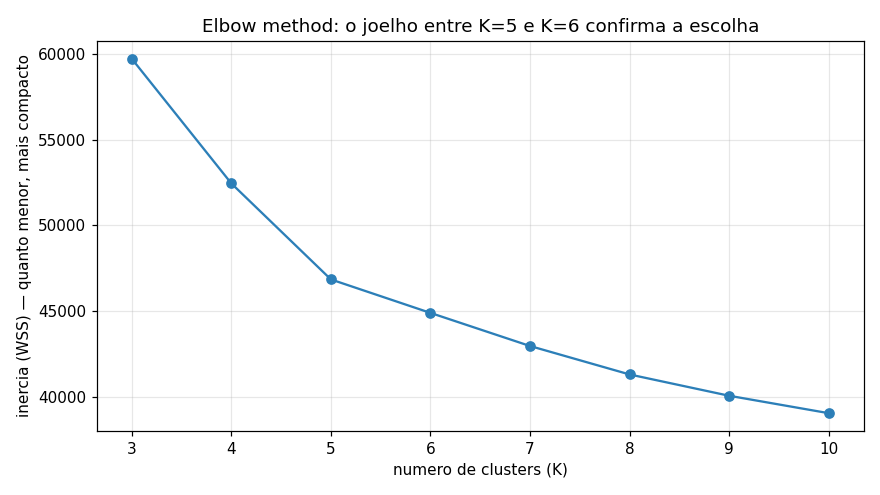
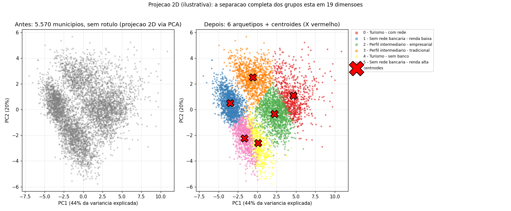
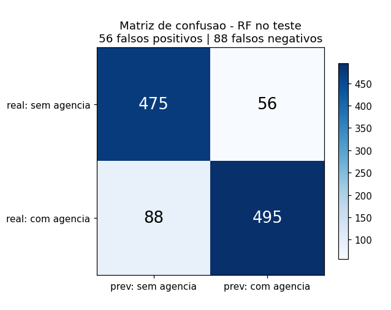

# Relatório da Etapa 3 — Modelagem (ML)

> **Data:** 2026-09-12
> **Base:** `referencias/DISCUSSAO_MODELOS_ETAPA3.md` (v2, escopo travado pelo grupo) e `docs/Plano_de_Implementacao_Etapa3_Modelagem.md`
> **Código:** módulos em `src/analytics/` (modelagem, clustering, classificacao, regressao, anomalias), experimentos em `notebooks/01_modelagem/` (3 notebooks executados), publicação em `scripts/08_publica_clusters_bigquery.py`
> **Tabela publicada:** `analytics_ipb_clusters` (5.570 municípios, integridade testada em `tests/data_quality/test_analytics_clusters.py`)
> **Stack:** somente scikit-learn (sem dependência nova, sem GPU, sem cloud — custo zero)

---

## 1. O contexto e a nossa maior restrição

A grande pergunta do projeto é simples: *onde estão os municípios brasileiros com muito potencial econômico, muita adoção digital, mas pouca concorrência bancária física?*

O problema prático é que **não existe um rótulo com a resposta certa.** Nenhum banco nos entregou uma lista dizendo "aqui estão as verdadeiras oportunidades de expansão". Também não temos o histórico de abertura e fechamento de agências para treinar o algoritmo. Por isso, toda a classificação e regressão nesta etapa precisou usar um **alvo proxy** (um substituto). Deixamos isso bem claro nos notebooks e a gente precisa reforçar isso na apresentação final: os modelos não "descobrem a verdade absoluta", eles apenas encontram padrões na presença bancária que já existe.

## 2. O dataset de modelagem

Nós geramos o arquivo `data/processed/modelagem.parquet` no notebook 01. Ele tem 5.570 municípios, 19 variáveis, 2 alvos e a referência do `ipb`/`rank` da V3 (usada só para cruzamento, nunca como variável de treino).

- **19 variáveis aprovadas** (discussão v2 §3): usamos demografia do Censo 2022, PIB 2023, CEMPRE 2024, Pix de ago/2025 a ago/2026 (o último ano completo disponível) e dados da Anatel e do Estban de 2026. Nós tiramos da conta os scores e ranks do índice, os dados que vieram vazios (como a internet do Censo), os números absolutos que causariam distorção de tamanho de cidade, e o IDHM de 2010 (que ficou muito defasado).
- **A transformação do log:** Aplicamos `log1p` nas 14 variáveis não-percentuais que tinham uma distribuição muito distorcida. Isso foi uma decisão crucial. Antes de fazer isso, o tamanho da população engolia todo o resto da conta, e o K-Means acabava separando São Paulo e outras capitais em grupos minúsculos isolados. Com o log, os clusters ficaram mais equilibrados e fáceis de analisar.
- **Perfil vs. Presença:** Dividimos as 19 variáveis em dois blocos. São 13 de "perfil da cidade" (renda, população, PIB, Pix, banda larga, etc.) e 6 de "presença bancária" (agências, correspondentes, depósitos e crédito). A regra de ouro aqui foi: para prever se uma cidade tem agência, Não podemos usar as métricas de presença bancária na conta, senão o modelo estaria apenas colando na prova (no jargão de dados, eu vazei o alvo). Então, os algoritmos só enxergam as 13 variáveis de perfil (`FEATURES_SEM_PRESENCA`).

## 3. Arquétipos — clusterização (K-Means + GMM)

Uma coisa que o IPB não responde sozinho: que tipos de cidades existem no Brasil e qual é o comportamento padrão de cada uma?

**Como escolhemos o K = 6:** Nós testamos criar de 3 a 10 grupos. Olhando os testes matemáticos (silhouette, inércia, elbow) e pensando no lado de negócios, batemos o martelo em 6 grupos. Se usássemos apenas 3, o modelo ficava burro e apenas dividia as cidades em "pequena, média e grande". Com 6, conseguimos enxergar nuances reais, e os grupos ficaram com um tamanho bom, variando de 653 a 1.278 cidades cada. Se a gente precisar mudar de ideia no futuro, o K = 5 também funciona bem.

Testamos também um algoritmo diferente (Agglomerative) para ver se ele concordava com o K-Means, mas os resultados divergiram muito. Essa é uma limitação que deixei registrada.

**Perfil dos 6 arquétipos** (temos um documento inteiro, `docs/Arquetipos_Municipais.md`, explicando isso com detalhes, mas o resumo é o seguinte):

| Cluster | Nome sugerido | Quantidade | Leitura rápida |
|---|---|---|---|
| 0 | Turismo - com rede | 740 | Destinos turísticos grandes e ricos. Já têm agências. |
| 1 | Sem rede bancária - renda baixa | 1.278 | Interior pobre e pouco formalizado. 100% sem agência. |
| 2 | Perfil intermediário - empresarial | 1.248 | PIB alto, Pix de empresas forte, cheio de empregos formais e com agências presentes. |
| 3 | Perfil intermediário - tradicional | 919 | Cidades médias com renda mediana. |
| 4 | **Turismo - sem banco** | 653 | **O grande achado:** Destinos turísticos pequenos, mas bem ricos. Estão 100% sem agência. |
| 5 | Sem rede bancária - renda alta | 732 | Cidades minúsculas com renda um pouco acima da média, quase todas sem banco. |

**Quão típica é cada cidade:** O modelo (usando GMM) também nos dá o nível de certeza sobre cada cidade. Cerca de 4.855 cidades se encaixam perfeitamente nos seus grupos (mais de 90% de confiança). Encontramos apenas umas 10 cidades "mestiças" (com menos de 50% de confiança). Elas costumam ser cidades pequenas do nordeste que parecem estar no meio do caminho entre dois perfis diferentes.

Para validar, tentamos adivinhar o arquétipo de cada cidade usando só o perfil dela, e a precisão bateu um F1 de 0,826. Quando o modelo erra, ele costuma confundir cidades turísticas ricas com cidades empresariais.

## 4. Classificação — prevendo onde já tem banco

Esse modelo não substitui o nosso índice. Ele serve só para cruzar com o IPB e validar nossas hipóteses.

**Como rodamos:** Separei 80% dos dados para o treino e 20% para testar, usando só as 13 variáveis de perfil da cidade. O modelo precisava responder apenas "sim" ou "não": essa cidade tem agência?

**Resultado (n = 1.114):**

| Modelo | ROC-AUC | PR-AUC | F1 | Precision | Recall | Acurácia | Tempo |
|---|---|---|---|---|---|---|---|
| **Random Forest** (tunado: 400 árv., prof. 20) | **0,939** | 0,951 | 0,873 | 0,898 | 0,849 | 0,871 | 18,4 s |
| **Regressão Logística** (tunada: C=10)| **0,938** | 0,950 | 0,869 | 0,892 | 0,847 | 0,866 | 1,2 s |
| KNN (k=15, distance) | 0,909 | 0,923 | 0,842 | 0,824 | 0,861 | 0,831 | 0,03 s |
| Árvore Simples (prof. 4) | 0,909 | 0,911 | 0,833 | 0,846 | 0,820 | 0,828 | 0,18 s |

O Random Forest e a Regressão Logística empataram na liderança. Acabou que o problema é bem matemático e linear, o que explica a Logística ir tão bem (e rodar muito mais rápido).

**O que faz o banco abrir uma agência:** Sabe aquela ideia de que banco vai atrás da infraestrutura? O algoritmo discorda em partes. A "População" domina o modelo quase que sozinha. Banco físico precisa de escala, eles colocam agência onde tem gente. Isso é engraçado porque vai totalmente contra o nosso IPB, onde a Banda Larga é o fator que mais pesa. O IPB caça a oportunidade ignorando a população, enquanto a realidade caça o volume de pessoas.

**Onde está o dinheiro (Nossos Resíduos):** Nós encontramos 56 municípios que o modelo jurava que tinham agência (probabilidade de 50% pra cima), mas na vida real não têm. Esse é o puro suco das **oportunidades**. E adivinha? A cidade de Bombinhas-SC, que lidera o ranking do nosso IPB, apareceu no topo dessa lista de resíduos do modelo, acompanhada de Colniza-MT e Balneário Rincão-SC. Isso valida bastante a nossa lógica.

## 5. Regressão — Explicando o IPB

Nós fizemos uma regressão onde o modelo tentava prever a nota do IPB V3 de cada cidade. O modelo acertou quase tudo, mas **isso era esperado**, afinal, nós demos para ele as mesmas variáveis que usamos para construir a fórmula matemática do IPB. O objetivo real aqui não era testar o modelo, mas ver **o que pesa mais** na nossa fórmula final:

| Variável | Queda de R² (Importância) |
|---|---|
| banda_larga_fixa_por_100_hab | **0,635** |
| correspondentes_por_100k_hab | 0,285 |
| pix_per_capita_12m | 0,167 |
| escolaridade_ensino_medio_pct | 0,068 |
| agencias_por_100k_hab | 0,059 |

Para ser muito honesto: hoje, o nosso IPB V3 é basicamente um índice focado em banda larga fixa, correspondentes e Pix. E tudo bem, os dados são assim mesmo. Como a banda larga puxa junto informações sobre renda e educação de tabela, ela acabou virando a principal engrenagem. 

## 6. Anomalias — Quem está fora do padrão (Top 30)

Rodamos o Isolation Forest para encontrar os municípios com comportamento mais estranho do Brasil bancário. No topo da lista apareceram: Fernando de Noronha, Curitiba, Barueri, São Caetano do Sul, São Paulo, Florianópolis e Águas de São Pedro.

Quando olhamos para eles em conjunto, percebemos que têm 5 vezes mais agências, o dobro de hotéis/restaurantes e 90% a mais de crédito em comparação com a média nacional. Ou seja, o nosso detector de anomalia funcionou perfeitamente para apontar duas coisas: as super-metrópoles entupidas de bancos (Curitiba, Barueri) e os pontos totalmente exóticos (Noronha, Águas de São Pedro).

## 7. Alguns tropeços

Quando você roda as coisas com os dados do mundo real, a teoria apanha um pouco. Precisamos fazer alguns ajustes de rota:

1. **Problema de escala:** Antes de usarmos a conversão de base logarítmica (log1p), a métrica de "população total" estragou nosso agrupamento. São Paulo virou um cluster de uma cidade só.
2. **Vazamento:** Na primeira vez que rodamos o modelo para prever se a cidade tinha agência, a pontuação deu 100%. Porque deixamos na base a variável `depositos_per_capita`. Se a cidade tem depósito bancário, é óbvio que ela tem agência. O modelo apenas leu isso e gabaritou. Separamos as variáveis corretamente depois disso.
3. **Alvo quebrado:** Tentamos prever se as cidades tinham "correspondentes bancários". Só que 100% dos municípios têm ao menos um correspondente no Brasil hoje. O modelo quebrou por falta de variação, mas aprendemos uma ótima lição de negócios sobre a rede do BCB.

## 8. Síntese — O que aprendemos com tudo isso

| O Modelo | Qual pergunta ele responde? | A resposta rápida |
|---|---|---|
| **Clusterização (K=6)** | Que tipos de municípios nós temos? | Encontramos 6 arquétipos, desde o interior sem nada até o destino turístico minúsculo e rico. |
| **Classificação (RF/Log)** | Onde o mercado faz sentido hoje? | População é o que mais atrai agência bancária. Achamos 56 cidades onde a conta fecha, mas o banco ainda não chegou. |
| **Classificador de Arquétipos** | Nossos agrupamentos fazem sentido? | Sim. Só olhando para o perfil da cidade, conseguimos acertar o arquétipo em 83% dos casos. |
| **Regressão** | O que realmente pesa no nosso IPB? | Banda larga, Correspondentes e Pix carregam o índice nas costas. |
| **Anomalias** | Quem destoa muito da realidade? | Separamos o Top 30 atípico, puxado por Fernando de Noronha. |

## 9. Limitações para deixar no radar

- **O que estamos prevendo:** Nenhum modelo aprendeu como achar uma "oportunidade real", apenas listamos hipóteses. Tudo é baseado em um alvo substituto.
- **Mix de datas:** Juntamos dados do Censo de 2022, com PIB de 2023, Pix de 2026 e CEMPRE de 2024. É a mesma deficiência do próprio IPB, mas é a realidade dos dados abertos hoje.
- **Vizinhança importa:** As cidades próximas costumam ser bem parecidas, e a nossa divisão aleatória de dados pode ter mascarado o quanto o modelo aprendeu de verdade sobre o espaço geográfico.
- **O segundo agrupador:** O modelo do GMM teve um score bem fraquinho (~0,10). Acabei mantendo ele só para extrair a probabilidade, mas o K-Means é quem manda nos grupos.
- **Discordância matemática:** O modelo hierárquico Agglomerative que testamos discordou frontalmente do nosso K-Means. Como não temos um gabarito da verdade, resolvi ficar com a visão do K-Means porque a lógica de negócios dela (e os testes do elbow) parava mais em pé.
- **Nomes criativos:** Os nomes que demos para os arquétipos ("Turismo sem banco", etc.) vieram das regras dos dados, mas a gente ainda precisa sentar e validar se todo mundo concorda.

---

*Entregas da rubrica: dataset de modelagem (§2), código de treinamento (módulos + notebooks), relatório (este), matriz de comparação (§4 e notebooks), gráficos em `docs/assets/figures/`, pipeline de inferência e a documentação técnica.*
